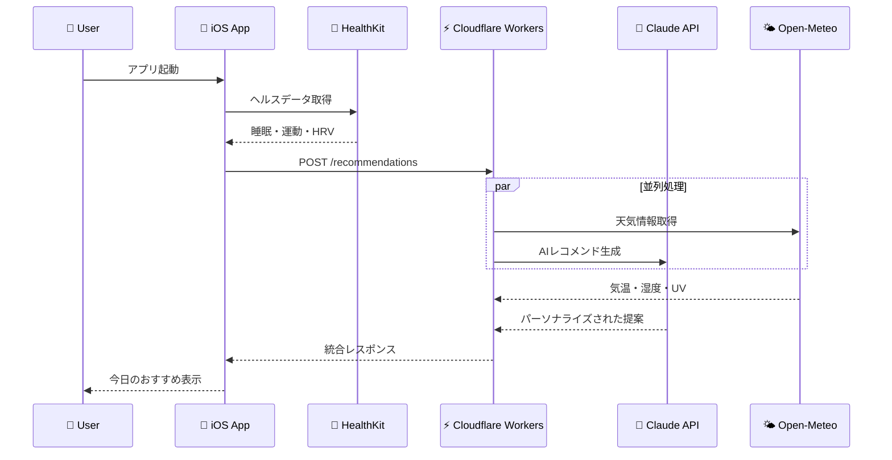

# Tempo AI

**「自分のテンポで、健やかな毎日を」**

[](https://developer.apple.com/ios/)
[](https://nodejs.org/)
[](https://workers.cloudflare.com/)
[](https://www.typescriptlang.org/)
[](https://www.anthropic.com/)

---

## 概要

Tempo AI は、ユーザーの生体リズム・活動量・回復状態などの HealthKit データと、気象・大気汚染などの環境データを AI が分析し、**その日の過ごし方**をパーソナライズしてアドバイスするヘルスケアアプリです。

静的な健康スコアではなく、「今日のあなたに合った過ごし方」を毎朝提案することで、ユーザーが自分のペースで健康を推進できるようサポートします。

### 主な機能

- **毎朝のパーソナライズドアドバイス** - 睡眠・HRV・活動量データと環境情報を統合分析
- **今日のトライ** - 1 日 1 つの新しいチャレンジを提案（5-15 分で完結）
- **今週のトライ** - 毎週月曜日に週を通して取り組むチャレンジを提案
- **追加アドバイス** - 昼（13 時〜）・夕（18 時〜）に短いフォローアップ
- **関心ごとタグ** - 美容、フィットネス、メンタルヘルス、仕事、栄養、睡眠から選択してパーソナライズ

---

## 技術スタック

| レイヤー     | 技術                   | バージョン                |
| ------------ | ---------------------- | ------------------------- |
| **iOS**      | SwiftUI                | iOS 17+                   |
|              | HealthKit              | -                         |
|              | CoreLocation           | -                         |
| **Backend**  | Cloudflare Workers     | -                         |
|              | Hono                   | 4.x                       |
|              | TypeScript             | 5.x                       |
| **AI**       | Claude API (Sonnet 4)  | claude-sonnet-4-20250514  |
|              | Claude API (Haiku)     | claude-haiku-4-5-20251001 |
| **外部 API** | Open-Meteo Weather     | Free tier                 |
|              | Open-Meteo Air Quality | Free tier                 |
| **ツール**   | pnpm                   | 9.x                       |
|              | Biome                  | 1.9.x                     |
|              | Vitest                 | 2.x                       |

---

## アーキテクチャ



### データフロー

1. ユーザーがアプリを起動
2. ローカルキャッシュを確認（同日のアドバイスがあれば表示）
3. キャッシュがなければ HealthKit からデータ取得
4. Backend API にリクエスト送信
5. Backend が気象・大気汚染データを取得
6. Claude API でアドバイス生成
7. レスポンスをキャッシュして表示

---

## 開発環境セットアップ

### 前提条件

- **Node.js** 20.0.0 以上
- **pnpm** 9.x（`corepack enable` で有効化推奨）
- **Xcode** 15.0 以上（iOS 開発用）
- **Wrangler CLI**（`pnpm add -g wrangler`）
- **Apple Developer Account**（実機テスト用）

### Backend セットアップ

```bash
# 1. リポジトリをクローン
git clone https://github.com/Bluefinee/tempo-ai.git
cd tempo-ai

# 2. Backend ディレクトリに移動
cd backend

# 3. 依存関係をインストール
pnpm install

# 4. 環境変数を設定（Cloudflare Secrets）
wrangler secret put ANTHROPIC_API_KEY
# プロンプトが表示されたら API キーを入力

# 5. 開発サーバーを起動
pnpm dev
# → http://localhost:8787 で起動
```

### iOS セットアップ

```bash
# 1. iOS ディレクトリに移動
cd ios/TempoAI

# 2. Xcode でプロジェクトを開く
open TempoAI.xcodeproj

# 3. Xcode で以下を設定
#    - Signing & Capabilities でチームを選択
#    - Bundle Identifier を変更（必要に応じて）
#    - HealthKit の権限が有効になっていることを確認

# 4. 実機またはシミュレータでビルド・実行
#    ⌘ + R
```

> **Note**: HealthKit のデータ取得には実機が必要です。シミュレータでは限定的なテストのみ可能です。

---

## 環境変数・シークレット

### Backend (Cloudflare Workers)

| 変数名              | 説明                                    | 必須 | 設定方法                                |
| ------------------- | --------------------------------------- | ---- | --------------------------------------- |
| `ANTHROPIC_API_KEY` | Claude API キー                         | ✓    | `wrangler secret put ANTHROPIC_API_KEY` |
| `ENVIRONMENT`       | 実行環境 (`development` / `production`) | ✓    | `wrangler.toml` で設定                  |

```toml
# wrangler.toml
[vars]
ENVIRONMENT = "development"
```

### iOS

API エンドポイントは `APIClient.swift` 内で設定：

```swift
private let baseURL: String = ProcessInfo.processInfo.environment["API_BASE_URL"] ?? "https://tempo-ai.YOUR_SUBDOMAIN.workers.dev"
```

---

## 開発コマンド

### Backend

```bash
# 開発サーバー起動
pnpm dev

# 本番デプロイ
pnpm deploy

# ステージングデプロイ
pnpm deploy:staging

# リント
pnpm lint
pnpm lint:fix

# フォーマット
pnpm format
pnpm format:check

# 型チェック
pnpm typecheck

# テスト
pnpm test
pnpm test:watch
pnpm test:coverage
pnpm test:ui

# リント + フォーマット + 型チェック
pnpm check
pnpm check:fix
```

### iOS

| 操作               | ショートカット           |
| ------------------ | ------------------------ |
| ビルド＆実行       | `⌘ + R`                  |
| テスト実行         | `⌘ + U`                  |
| クリーンビルド     | `⌘ + Shift + K`          |
| ビルドフォルダ削除 | `⌘ + Option + Shift + K` |

---

## プロジェクト構造

```text
tempo-ai/
├── .github/                    # CI/CD ワークフロー
│   └── workflows/
│       ├── ios-ci.yml         # iOS品質チェック・テスト
│       └── backend-ci.yml     # Backend品質チェック・テスト
│
├── backend/                    # Cloudflare Workers API
│   ├── src/
│   │   ├── index.ts           # Honoエントリーポイント（JSDoc完備）
│   │   ├── routes/            # 将来のAPI routes
│   │   ├── services/          # 将来のビジネスロジック
│   │   │   ├── claude.ts      # Claude API 統合（予定）
│   │   │   ├── weather.ts     # Open-Meteo Weather API（予定）
│   │   │   └── airQuality.ts  # Open-Meteo Air Quality API（予定）
│   │   ├── types/
│   │   │   └── response.ts    # Zodスキーマによる型安全レスポンス
│   │   ├── utils/             # ユーティリティ（予定）
│   │   └── prompts/           # AIプロンプト（予定）
│   ├── tests/                 # Vitestテストファイル
│   ├── wrangler.toml          # Cloudflare Workers設定
│   ├── package.json           # pnpm scripts・依存関係
│   ├── biome.json             # Linter/Formatter設定
│   ├── tsconfig.json          # TypeScript設定
│   └── vitest.config.ts       # テスト設定
│
├── ios/                        # iOS アプリディレクトリ
│   └── TempoAI/               # SwiftUI プロジェクト
│       ├── App/
│       │   ├── TempoAIApp.swift    # アプリエントリーポイント
│       │   └── ContentView.swift   # メインビュー
│       ├── Features/               # 機能別ディレクトリ（予定）
│       │   ├── Onboarding/         # オンボーディング画面
│       │   ├── Home/               # ホーム・アドバイス表示
│       │   └── Settings/           # 設定画面
│       ├── Services/               # データ管理層（予定）
│       │   ├── HealthKitManager.swift
│       │   ├── LocationManager.swift
│       │   ├── APIClient.swift
│       │   └── CacheManager.swift
│       ├── Shared/                 # 共有コンポーネント（予定）
│       │   ├── Models/
│       │   ├── Extensions/
│       │   └── Components/
│       ├── Resources/              # アセット・リソース
│       ├── TempoAI.xcodeproj/      # Xcodeプロジェクト設定
│       └── TempoAITests/           # ユニットテスト
│           └── TempoAITests.swift
│
├── docs/                       # ドキュメント
│   ├── product-spec.md         # プロダクト仕様書
│   ├── technical-spec.md       # 技術仕様書（更新済み）
│   ├── ai-prompt-design.md     # AIプロンプト設計書
│   ├── claude-plans/           # 段階的開発計画
│   └── reviews/                # コードレビュー記録
│
├── .claude/                    # 開発ガイドライン・規約
│   ├── CLAUDE.md               # 全体開発方針・原則
│   ├── swift-coding-standards.md      # Swift規約
│   ├── typescript-hono-standards.md   # TypeScript/Hono規約
│   ├── ux_concepts.md          # UX設計原則
│   └── messaging_guidelines.md # メッセージング規約
│
├── .swiftlint.yml              # SwiftLint設定（ios/ディレクトリ対応）
├── CLAUDE.md                   # 開発ガイドライン・自動化コマンド
└── README.md                   # このファイル
```

---

## ドキュメント

| ドキュメント        | パス                                   | 内容                                                       |
| ------------------- | -------------------------------------- | ---------------------------------------------------------- |
| プロダクト仕様書    | `docs/product-spec.md`                 | 機能要件、ユーザープロフィール設計、オンボーディングフロー |
| 技術仕様書          | `docs/tech-spec.md`                    | システムアーキテクチャ、iOS/Backend 設計、API 仕様         |
| AI プロンプト設計書 | `docs/ai-prompt-design.md`             | プロンプト構造、例文集、JSON 出力スキーマ                  |
| Swift 規約          | `.claude/swift-coding-standards.md`    | iOS 開発のコーディング規約                                 |
| TypeScript 規約     | `.claude/typescript-hono-standards.md` | Backend 開発の規約                                         |
| UX 原則             | `.claude/ux_concepts.md`               | UI デザインの原則                                          |
| 開発ガイドライン    | `.claude/CLAUDE.md`                    | 全体の開発方針                                             |

---

## API エンドポイント

### POST /api/advice

メインアドバイス生成

```typescript
// Request
{
  userProfile: UserProfile;
  healthData: HealthData;
  location: { latitude: number; longitude: number; city?: string };
  context: {
    currentTime: string;      // ISO 8601
    dayOfWeek: string;
    isMonday: boolean;
    recentDailyTries: string[];
    lastWeeklyTry?: string;
  };
}

// Response
{
  success: boolean;
  data?: {
    mainAdvice: DailyAdvice;
    additionalAdvice?: AdditionalAdvice;
  };
  error?: string;
}
```

### POST /api/advice/additional

追加アドバイス生成（昼・夕）

```typescript
// Request
{
  userProfile: Pick<UserProfile, "nickname" | "interests">;
  timeSlot: "afternoon" | "evening";
  morningData: { hrvMs?: number; restingHeartRate?: number };
  currentData: { stepsSoFar: number; avgHeartRateSinceMorning?: number };
}
```

---

## コスト見積もり

| 用途             | モデル          | 1 リクエスト | 月間（30 日）       |
| ---------------- | --------------- | ------------ | ------------------- |
| メインアドバイス | Claude Sonnet 4 | ~$0.024      | ~$0.72/ユーザー     |
| 追加アドバイス   | Claude Haiku    | ~$0.002      | ~$0.06/ユーザー     |
| **合計**         |                 |              | **~$0.84/ユーザー** |

※ Prompt Caching 適用時の目安

---

## 重要な制約

> **⚠️ 医学的なアドバイス・診断は絶対に行わない**
>
> Tempo AI は健康的なライフスタイルをサポートするためのウェルネスアプリであり、医療行為・医学的診断・治療の代替となるものではありません。

---

## Code Rabbit レビュー

CodeRabbit CLI を使用した自動コードレビューを実施します。

### 使い方

以下のプロンプトを Claude Code に送信してください：

```
Code Rabbitでレビューを実行し、修正してください。

## 手順


### Step 1: レビュー実行
以下のコマンドを実行し、完了まで待機する（5-10分かかる。全てのレビュー内容を出力すること。）：
coderabbit review --plain > docs/reviews/$(date +%Y%m%d-%H%M)-code-rabbit-review-results.txt 2>&1

### Step 2: 修正計画の作成
レビュー結果を分析し、同ディレクトリにその修正プランである `YYYYMMDD-HHMM-fix-plan.md` を作成する。

形式：
- 指摘ごとに「ファイルパス」「指摘内容」「対応（✅修正 or ⏭️スキップ）」を記載
- スキップする場合は理由を明記
- 優先順位：セキュリティ > ロジックエラー > パフォーマンス > コードスタイル

### Step 4: 修正の実施
修正計画に従い、優先順位順に修正を行う。

## 修正方針
- 原則：すべての指摘を修正対象とする。code rabbitのレビュー内容は、該当のテキストファイルに必ず全て出力すること。
- 例外：指摘が明らかに誤り、またはプロジェクト方針と矛盾する場合のみスキップ可
```
