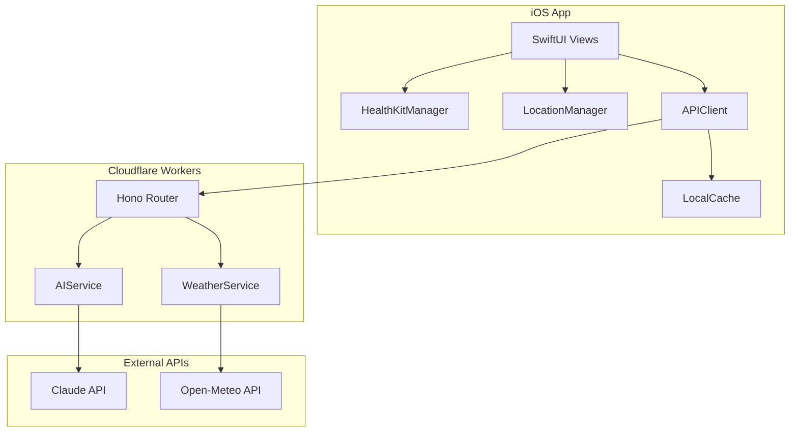
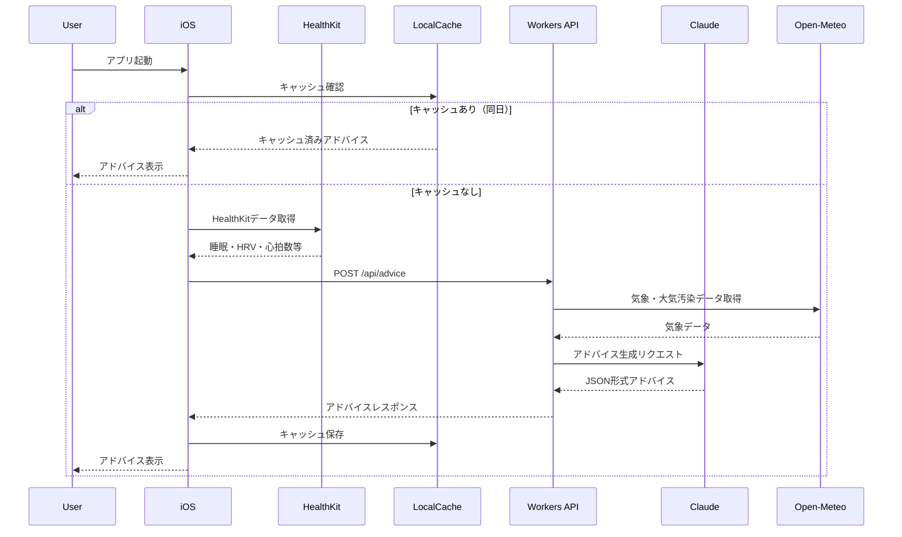

# Tempo AI 技術仕様書

**バージョン**: 1.1
**最終更新日**: 2025年12月13日  
**ステータス**: MVP 開発準備中

---

## 関連ドキュメント

本仕様書は以下のドキュメントと併せて参照してください：

| ドキュメント        | パス                                   | 内容                                      |
| ------------------- | -------------------------------------- | ----------------------------------------- |
| プロダクト仕様書    | `docs/product-spec.md`                 | 機能要件、ユーザープロフィール設計        |
| AI プロンプト設計書 | `docs/ai-prompt-design.md`             | プロンプト構造、例文集、JSON 出力スキーマ |
| Swift 規約          | `.claude/swift-coding-standards.md`    | iOS 開発のコーディング規約                |
| TypeScript 規約     | `.claude/typescript-hono-standards.md` | バックエンド開発の規約                    |
| UX 原則             | `.claude/ux_concepts.md`               | UI デザインの原則                         |
| 開発ガイドライン    | `.claude/CLAUDE.md`                    | 全体の開発方針                            |

---

## 1. システムアーキテクチャ

### 1.1 全体構成



### 1.2 技術スタック

| レイヤー | 技術                  | バージョン                |
| -------- | --------------------- | ------------------------- |
| iOS      | SwiftUI               | iOS 17+                   |
| iOS      | HealthKit             | -                         |
| iOS      | CoreLocation          | -                         |
| Backend  | Cloudflare Workers    | -                         |
| Backend  | Hono                  | 4.x                       |
| Backend  | TypeScript            | 5.x                       |
| AI       | Claude API (Sonnet 4) | claude-sonnet-4-20250514  |
| AI       | Claude API (Haiku)    | claude-haiku-4-5-20251001 |
| Weather  | Open-Meteo API        | Free tier                 |

### 1.3 データフロー（アドバイス生成）



---

## 2. iOS 設計

### 2.1 ディレクトリ構造

```
ios/
└── TempoAI/
    ├── App/
    │   ├── TempoAIApp.swift
    │   └── ContentView.swift
    ├── Features/
    │   ├── Onboarding/
    │   │   ├── Views/
    │   │   │   ├── OnboardingContainerView.swift
    │   │   │   ├── WelcomeView.swift
    │   │   │   ├── NicknameInputView.swift
    │   │   │   ├── BasicInfoView.swift
    │   │   │   ├── LifestyleView.swift
    │   │   │   ├── InterestsView.swift
    │   │   │   └── PermissionsView.swift
    │   │   └── Models/
    │   │       └── OnboardingState.swift
    │   ├── Home/
    │   │   ├── Views/
    │   │   │   ├── HomeView.swift
    │   │   │   ├── AdviceSummaryCard.swift
    │   │   │   ├── AdviceDetailView.swift
    │   │   │   ├── DailyTryCard.swift
    │   │   │   └── WeeklyTryCard.swift
    │   │   └── Models/
    │   │       └── DailyAdvice.swift
    │   └── Settings/
    │       ├── Views/
    │       │   ├── SettingsView.swift
    │       │   ├── ProfileEditView.swift
    │       │   └── InterestsEditView.swift
    │       └── Models/
    │           └── UserProfile.swift
    ├── Services/
    │   ├── HealthKitManager.swift
    │   ├── LocationManager.swift
    │   ├── APIClient.swift
    │   └── CacheManager.swift
    ├── Shared/
    │   ├── Models/
    │   │   ├── HealthData.swift
    │   │   ├── WeatherData.swift
    │   │   └── APIError.swift
    │   ├── Extensions/
    │   │   ├── Date+Extensions.swift
    │   │   └── Color+Extensions.swift
    │   └── Components/
    │       ├── LoadingView.swift
    │       └── ErrorView.swift
    ├── Resources/
    │   ├── Assets.xcassets/
    │   └── Localizable.strings
    ├── TempoAI.xcodeproj/
    └── TempoAITests/
        └── TempoAITests.swift
```

### 2.2 主要クラス設計

#### HealthKitManager

```swift
import HealthKit

@MainActor
final class HealthKitManager: ObservableObject {
    // MARK: - Properties

    @Published var isAuthorized: Bool = false
    @Published var authorizationStatus: String = "Not Determined"

    private let healthStore: HKHealthStore = HKHealthStore()

    // MARK: - Required Data Types

    private let requiredTypes: Set<HKObjectType> = [
        HKQuantityType(.heartRate),
        HKQuantityType(.heartRateVariabilitySDNN),
        HKQuantityType(.restingHeartRate),
        HKQuantityType(.stepCount),
        HKCategoryType(.sleepAnalysis),
        HKQuantityType(.activeEnergyBurned)
    ]

    private let optionalTypes: Set<HKObjectType> = [
        HKQuantityType(.oxygenSaturation),
        HKQuantityType(.bodyTemperature)
    ]

    // MARK: - Public Methods

    func requestAuthorization() async throws { }
    func fetchTodayHealthData() async throws -> HealthData { }
    func fetchWeekTrends() async throws -> WeekTrends { }
}
```

#### LocationManager

```swift
import CoreLocation

@MainActor
final class LocationManager: NSObject, ObservableObject {
    // MARK: - Properties

    @Published var currentCity: String? = nil
    @Published var coordinates: CLLocationCoordinate2D? = nil
    @Published var authorizationStatus: CLAuthorizationStatus = .notDetermined

    private let locationManager: CLLocationManager = CLLocationManager()

    // MARK: - Public Methods

    func requestAuthorization() { }
    func requestCurrentLocation() { }
}
```

#### APIClient

```swift
import Foundation

final class APIClient {
    // MARK: - Properties

    static let shared: APIClient = APIClient()

    private let baseURL: String =
        ProcessInfo.processInfo.environment["API_BASE_URL"]
        ?? "https://tempo-ai.YOUR_SUBDOMAIN.workers.dev"
    private let session: URLSession = URLSession.shared

    // MARK: - Public Methods

    func generateAdvice(request: AdviceRequest) async throws -> DailyAdvice { }
    func generateAdditionalAdvice(request: AdditionalAdviceRequest) async throws -> AdditionalAdvice { }
}
```

#### CacheManager

```swift
import Foundation

final class CacheManager {
    // MARK: - Properties

    static let shared: CacheManager = CacheManager()

    private let userDefaults: UserDefaults = UserDefaults.standard
    private let fileManager: FileManager = FileManager.default

    // MARK: - Keys

    private enum Keys {
        static let userProfile: String = "userProfile"
        static let todayAdvice: String = "todayAdvice"
        static let recentDailyTries: String = "recentDailyTries"
        static let lastWeeklyTry: String = "lastWeeklyTry"
        static let onboardingCompleted: String = "onboardingCompleted"
    }

    // MARK: - User Profile

    func saveUserProfile(_ profile: UserProfile) { }
    func loadUserProfile() -> UserProfile? { }

    // MARK: - Advice Cache

    func saveAdvice(_ advice: DailyAdvice, for date: Date) { }
    func loadAdvice(for date: Date) -> DailyAdvice? { }
    func isAdviceCached(for date: Date, timeSlot: TimeSlot) -> Bool { }

    // MARK: - Try History (過去2週間分を保持)

    func saveDailyTry(_ topic: String, date: Date) { }
    func getRecentDailyTries(days: Int) -> [String] { }
    func saveWeeklyTry(_ topic: String) { }
    func getLastWeeklyTry() -> String? { }
}
```

### 2.3 データモデル

#### UserProfile

```swift
struct UserProfile: Codable {
    let nickname: String
    let age: Int
    let gender: Gender
    let weightKg: Double
    let heightCm: Double
    let occupation: Occupation?
    let lifestyleRhythm: LifestyleRhythm?
    let exerciseFrequency: ExerciseFrequency?
    let alcoholFrequency: AlcoholFrequency?
    let interests: [Interest]

    enum Gender: String, Codable, CaseIterable {
        case male = "male"
        case female = "female"
        case other = "other"
        case notSpecified = "not_specified"
    }

    enum Occupation: String, Codable, CaseIterable {
        case itEngineer = "it_engineer"
        case sales = "sales"
        case standingWork = "standing_work"
        case medical = "medical"
        case creative = "creative"
        case homemaker = "homemaker"
        case student = "student"
        case freelance = "freelance"
        case other = "other"
    }

    enum LifestyleRhythm: String, Codable, CaseIterable {
        case morning = "morning"
        case night = "night"
        case irregular = "irregular"
    }

    enum ExerciseFrequency: String, Codable, CaseIterable {
        case daily = "daily"
        case threeToFour = "three_to_four"
        case oneToTwo = "one_to_two"
        case rarely = "rarely"
    }

    enum AlcoholFrequency: String, Codable, CaseIterable {
        case never = "never"
        case monthly = "monthly"
        case oneToTwo = "one_to_two"
        case threeOrMore = "three_or_more"
    }

    enum Interest: String, Codable, CaseIterable {
        case beauty = "beauty"
        case fitness = "fitness"
        case mentalHealth = "mental_health"
        case workPerformance = "work_performance"
        case nutrition = "nutrition"
        case sleep = "sleep"
    }
}
```

#### HealthData

```swift
struct HealthData: Codable {
    let date: Date
    let sleep: SleepData?
    let morningVitals: MorningVitals?
    let yesterdayActivity: ActivityData?
    let weekTrends: WeekTrends?

    struct SleepData: Codable {
        let bedtime: Date?
        let wakeTime: Date?
        let durationHours: Double
        let deepSleepHours: Double?
        let remSleepHours: Double?
        let awakenings: Int
        let avgHeartRate: Int?
    }

    struct MorningVitals: Codable {
        let restingHeartRate: Int?
        let hrvMs: Double?
        let bloodOxygen: Int?
    }

    struct ActivityData: Codable {
        let steps: Int
        let workoutMinutes: Int?
        let workoutType: String?
        let caloriesBurned: Int?
    }

    struct WeekTrends: Codable {
        let avgSleepHours: Double
        let avgHrv: Double?
        let avgRestingHeartRate: Int?
        let avgSteps: Int
        let totalWorkoutHours: Double?
    }
}
```

#### DailyAdvice（AI プロンプト設計書の JSON 出力スキーマに対応）

```swift
struct DailyAdvice: Codable {
    let greeting: String
    let condition: Condition
    let actionSuggestions: [ActionSuggestion]
    let closingMessage: String
    let dailyTry: TryContent
    let weeklyTry: TryContent?
    let generatedAt: Date
    let timeSlot: TimeSlot

    struct Condition: Codable {
        let summary: String
        let detail: String
    }

    struct ActionSuggestion: Codable {
        let icon: IconType
        let title: String
        let detail: String

        enum IconType: String, Codable {
            case fitness, stretch, nutrition, hydration
            case rest, work, sleep, mental, beauty, outdoor
        }
    }

    struct TryContent: Codable {
        let title: String
        let summary: String
        let detail: String
    }

    enum TimeSlot: String, Codable {
        case morning = "morning"
        case afternoon = "afternoon"
        case evening = "evening"
    }
}

struct AdditionalAdvice: Codable {
    let timeSlot: DailyAdvice.TimeSlot
    let greeting: String
    let message: String
    let generatedAt: Date
}
```

#### MetricsScore（新メトリクス体系）

```swift
/// メトリクススコア（0-100）
/// 詳細なアルゴリズムは docs/metrics-algorithm-spec.md を参照
struct MetricsScore: Codable {
    let date: Date
    let sleep: MetricDetail
    let hrv: MetricDetail
    let rhythm: MetricDetail
    let activity: MetricDetail

    struct MetricDetail: Codable {
        let score: Int  // 0-100
        let status: MetricStatus
        let trend: Trend
        let components: [String: Int]?  // スコア内訳

        enum MetricStatus: String, Codable {
            case excellent = "excellent"  // 80-100
            case good = "good"            // 60-79
            case fair = "fair"            // 40-59
            case low = "low"              // 20-39
            case poor = "poor"            // 0-19

            static func from(score: Int) -> MetricStatus {
                switch score {
                case 80...100: return .excellent
                case 60..<80: return .good
                case 40..<60: return .fair
                case 20..<40: return .low
                default: return .poor
                }
            }
        }

        enum Trend: String, Codable {
            case improving = "improving"
            case stable = "stable"
            case declining = "declining"
        }
    }
}

/// ストレスグラフデータ
/// 24時間の自律神経バランス推移
struct StressGraphData: Codable {
    let date: Date
    let dataPoints: [DataPoint]
    let summary: Summary

    struct DataPoint: Codable {
        let timestamp: Date
        let balance: Double  // -100 (ストレス) 〜 +100 (リラックス)
    }

    struct Summary: Codable {
        let avgBalance: Double
        let minBalance: Double
        let maxBalance: Double
        let peakStressTime: Date?
        let mostRelaxedTime: Date?
    }
}

/// 相関分析結果
/// 詳細なアルゴリズムは docs/correlation-analysis-spec.md を参照
struct CorrelationAnalysis: Codable {
    let analyzedAt: Date
    let dataRange: DateInterval
    let sampleSize: Int
    let pairs: [PairCorrelation]
    let insights: [CorrelationInsight]

    struct PairCorrelation: Codable {
        let pair: String  // e.g., "hrv_sleep", "rhythm_sleep"
        let coefficient: Double  // -1.0 to 1.0
        let strength: CorrelationStrength
        let isSignificant: Bool

        enum CorrelationStrength: String, Codable {
            case strong = "strong"      // |r| >= 0.7
            case moderate = "moderate"  // 0.4 <= |r| < 0.7
            case weak = "weak"          // 0.2 <= |r| < 0.4
            case none = "none"          // |r| < 0.2
        }
    }

    struct CorrelationInsight: Codable {
        let pair: String
        let message: String
        let actionSuggestion: String?
    }
}
```

### 2.4 ストレージ設計

| データ                     | 保存先       | キー/パス                        | TTL     |
| -------------------------- | ------------ | -------------------------------- | ------- |
| ユーザープロフィール       | UserDefaults | `userProfile`                    | 永続    |
| オンボーディング完了フラグ | UserDefaults | `onboardingCompleted`            | 永続    |
| 当日のアドバイス           | UserDefaults | `advice_{yyyy-MM-dd}_{timeSlot}` | 24 時間 |
| 過去の DailyTry トピック   | UserDefaults | `recentDailyTries`               | 14 日分 |
| 直近の WeeklyTry トピック  | UserDefaults | `lastWeeklyTry`                  | 7 日    |

---

## 3. バックエンド設計

### 3.1 ディレクトリ構造

```
backend/
├── src/
│   ├── index.ts              # エントリーポイント
│   ├── routes/
│   │   └── advice.ts         # アドバイス生成エンドポイント
│   ├── services/
│   │   ├── claude.ts         # Claude API統合
│   │   ├── weather.ts        # Open-Meteo Weather API
│   │   └── airQuality.ts     # Open-Meteo Air Quality API
│   ├── types/
│   │   ├── request.ts        # リクエスト型定義
│   │   ├── response.ts       # レスポンス型定義
│   │   └── domain.ts         # ドメイン型定義
│   ├── utils/
│   │   ├── prompt.ts         # プロンプト組み立て
│   │   └── errors.ts         # エラーハンドリング
│   └── prompts/
│       ├── system.ts         # Layer 1: システムプロンプト
│       └── examples/         # Layer 2: 関心ごと別例文
│           ├── fitness.ts
│           ├── beauty.ts
│           ├── mental.ts
│           ├── work.ts
│           ├── nutrition.ts
│           └── sleep.ts
├── wrangler.toml
├── package.json
└── tsconfig.json
```

### 3.2 API エンドポイント

#### POST /api/advice

メインアドバイス生成（＋追加アドバイスの生成判定含む）

```typescript
// Request
interface AdviceRequest {
  userProfile: UserProfile;
  healthData: HealthData;
  location: LocationData;
  context: RequestContext;
}

interface LocationData {
  latitude: number;
  longitude: number;
  city?: string;
}

interface RequestContext {
  currentTime: string; // ISO 8601
  dayOfWeek: string; // "monday" | "tuesday" | ...
  isMonday: boolean;
  recentDailyTries: string[]; // 過去2週間のトピック
  lastWeeklyTry?: string;
}

// Response
interface AdviceResponse {
  success: boolean;
  data?: {
    mainAdvice: DailyAdvice;
    additionalAdvice?: AdditionalAdvice; // 13時以降 or 18時以降の場合
  };
  error?: string;
}
```

#### POST /api/advice/additional

追加アドバイスのみ生成（昼・夕）

```typescript
// Request
interface AdditionalAdviceRequest {
  userProfile: Pick<UserProfile, "nickname" | "interests">;
  timeSlot: "afternoon" | "evening";
  morningData: {
    hrvMs?: number;
    restingHeartRate?: number;
  };
  currentData: {
    stepsSoFar: number;
    avgHeartRateSinceMorning?: number;
  };
}

// Response
interface AdditionalAdviceResponse {
  success: boolean;
  data?: AdditionalAdvice;
  error?: string;
}
```

### 3.3 環境変数

```toml
# wrangler.toml
[vars]
ENVIRONMENT = "production"

# secrets (wrangler secret put で設定)
# ANTHROPIC_API_KEY
```

| 変数名              | 説明                                    | 必須 |
| ------------------- | --------------------------------------- | ---- |
| `ANTHROPIC_API_KEY` | Claude API キー                         | ✓    |
| `ENVIRONMENT`       | 実行環境 (`development` / `production`) | ✓    |

### 3.4 型定義

```typescript
// types/domain.ts

interface UserProfile {
  nickname: string;
  age: number;
  gender: "male" | "female" | "other" | "not_specified";
  weightKg: number;
  heightCm: number;
  occupation?: string;
  lifestyleRhythm?: "morning" | "night" | "irregular";
  exerciseFrequency?: "daily" | "three_to_four" | "one_to_two" | "rarely";
  alcoholFrequency?: "never" | "monthly" | "one_to_two" | "three_or_more";
  interests: Interest[];
}

type Interest =
  | "beauty"
  | "fitness"
  | "mental_health"
  | "work_performance"
  | "nutrition"
  | "sleep";

interface HealthData {
  date: string;
  sleep?: SleepData;
  morningVitals?: MorningVitals;
  yesterdayActivity?: ActivityData;
  weekTrends?: WeekTrends;
}

interface WeatherData {
  condition: string;
  tempCurrentC: number;
  tempMaxC: number;
  tempMinC: number;
  humidityPercent: number;
  uvIndex: number;
  pressureHpa: number;
  precipitationProbability: number;
}

interface AirQualityData {
  aqi: number;
  pm25: number;
  pm10?: number;
}
```

---

## 4. Claude API 統合

### 4.1 Prompt Caching 戦略

プロダクト仕様書「AI プロンプト設計書」の Layer 構造に従います。

```
┌────────────────────────────────────────────────────┐
│ Layer 1: システムプロンプト                         │
│ - 役割定義、禁止事項、トーン、出力形式             │
│ - 約1,500トークン                                  │
│ - TTL: 1時間                                       │
│ - cache_control: { type: "ephemeral" }            │
├────────────────────────────────────────────────────┤
│ Layer 2: 関心ごと別例文                            │
│ - ユーザーの優先タグに基づいて選択                 │
│ - 約2,000トークン                                  │
│ - TTL: 5分（デフォルト）                           │
├────────────────────────────────────────────────────┤
│ Layer 3: ユーザーデータ                            │
│ - プロフィール、HealthKit、気象データ              │
│ - 約500-800トークン                                │
│ - キャッシュなし                                   │
└────────────────────────────────────────────────────┘
```

### 4.2 モデル選定

| 用途                     | モデル                    | 理由                       |
| ------------------------ | ------------------------- | -------------------------- |
| メインアドバイス         | claude-sonnet-4-20250514  | 複雑な分析、パーソナライズ |
| 追加アドバイス（昼・夕） | claude-haiku-4-5-20251001 | 短文、低コスト             |

### 4.3 実装例

```typescript
// services/claude.ts

import Anthropic from "@anthropic-ai/sdk";
import { buildSystemPrompt } from "../prompts/system";
import { getExamplesForInterest } from "../prompts/examples";

interface GenerateAdviceParams {
  userProfile: UserProfile;
  healthData: HealthData;
  weatherData: WeatherData;
  airQualityData: AirQualityData;
  context: RequestContext;
  apiKey: string;
}

export const generateMainAdvice = async (
  params: GenerateAdviceParams
): Promise<DailyAdvice> => {
  const client = new Anthropic({ apiKey: params.apiKey });

  const systemPrompt = buildSystemPrompt();
  const examples = getExamplesForInterest(params.userProfile.interests[0]);
  const userData = buildUserDataPrompt(params);

  const response = await client.messages.create({
    model: "claude-sonnet-4-20250514",
    max_tokens: 4096,
    system: [
      {
        type: "text",
        text: systemPrompt,
        cache_control: { type: "ephemeral" },
      },
      {
        type: "text",
        text: examples,
        cache_control: { type: "ephemeral" },
      },
    ],
    messages: [
      {
        role: "user",
        content: userData,
      },
    ],
  });

  return parseAdviceResponse(response);
};

export const generateAdditionalAdvice = async (
  params: AdditionalAdviceParams
): Promise<AdditionalAdvice> => {
  const client = new Anthropic({ apiKey: params.apiKey });

  // Haikuを使用（軽量プロンプト）
  const response = await client.messages.create({
    model: "claude-haiku-4-5-20251001",
    max_tokens: 1024,
    system: buildAdditionalAdviceSystemPrompt(),
    messages: [
      {
        role: "user",
        content: buildAdditionalAdviceUserPrompt(params),
      },
    ],
  });

  return parseAdditionalAdviceResponse(response);
};
```

### 4.4 コスト見積もり

| 項目                          | トークン数 | 単価           | 1 リクエスト |
| ----------------------------- | ---------- | -------------- | ------------ |
| **メインアドバイス (Sonnet)** |            |                |              |
| 入力（キャッシュヒット時）    | ~3,500     | $0.30/1M × 0.1 | $0.000105    |
| 入力（キャッシュミス時）      | ~500       | $3.00/1M       | $0.0015      |
| 出力                          | ~1,500     | $15.00/1M      | $0.0225      |
| **小計**                      |            |                | **~$0.024**  |
| **追加アドバイス (Haiku)**    |            |                |              |
| 入力                          | ~500       | $0.80/1M       | $0.0004      |
| 出力                          | ~300       | $4.00/1M       | $0.0012      |
| **小計**                      |            |                | **~$0.002**  |

**月間コスト目安**（1 日 1 回利用、30 日）:

- メインのみ: ~$0.72/月/ユーザー
- メイン + 追加 2 回: ~$0.84/月/ユーザー

---

## 5. 外部 API 統合

### 5.1 Open-Meteo Weather API

```typescript
// services/weather.ts

const WEATHER_API_BASE = "https://api.open-meteo.com/v1/forecast";

interface WeatherParams {
  latitude: number;
  longitude: number;
}

export const fetchWeatherData = async (
  params: WeatherParams
): Promise<WeatherData> => {
  const url = new URL(WEATHER_API_BASE);
  url.searchParams.set("latitude", params.latitude.toString());
  url.searchParams.set("longitude", params.longitude.toString());
  url.searchParams.set(
    "current",
    [
      "temperature_2m",
      "relative_humidity_2m",
      "weather_code",
      "surface_pressure",
    ].join(",")
  );
  url.searchParams.set(
    "daily",
    [
      "temperature_2m_max",
      "temperature_2m_min",
      "uv_index_max",
      "precipitation_probability_max",
    ].join(",")
  );
  url.searchParams.set("timezone", "Asia/Tokyo");

  const response = await fetch(url.toString());

  if (!response.ok) {
    throw new WeatherApiError(`Weather API error: ${response.status}`);
  }

  const data = await response.json();
  return transformWeatherResponse(data);
};
```

### 5.2 Open-Meteo Air Quality API

```typescript
// services/airQuality.ts

const AIR_QUALITY_API_BASE =
  "https://air-quality-api.open-meteo.com/v1/air-quality";

export const fetchAirQualityData = async (params: {
  latitude: number;
  longitude: number;
}): Promise<AirQualityData> => {
  const url = new URL(AIR_QUALITY_API_BASE);
  url.searchParams.set("latitude", params.latitude.toString());
  url.searchParams.set("longitude", params.longitude.toString());
  url.searchParams.set("current", ["pm2_5", "pm10", "us_aqi"].join(","));

  const response = await fetch(url.toString());

  if (!response.ok) {
    throw new AirQualityApiError(`Air Quality API error: ${response.status}`);
  }

  const data = await response.json();
  return {
    aqi: data.current.us_aqi,
    pm25: data.current.pm2_5,
    pm10: data.current.pm10,
  };
};
```

### 5.3 フォールバック戦略

| 失敗ケース           | フォールバック                             |
| -------------------- | ------------------------------------------ |
| Weather API 失敗     | 気象関連アドバイスを省略してアドバイス生成 |
| Air Quality API 失敗 | 大気汚染関連アドバイスを省略               |
| 両方失敗             | 気象・環境データなしでアドバイス生成       |

```typescript
// routes/advice.ts

const fetchEnvironmentData = async (
  location: LocationData
): Promise<{ weather?: WeatherData; airQuality?: AirQualityData }> => {
  const results: { weather?: WeatherData; airQuality?: AirQualityData } = {};

  try {
    results.weather = await fetchWeatherData(location);
  } catch (error) {
    console.error("Weather fetch failed:", error);
  }

  try {
    results.airQuality = await fetchAirQualityData(location);
  } catch (error) {
    console.error("Air quality fetch failed:", error);
  }

  return results;
};
```

---

## 6. エラーハンドリング

### 6.1 エラー分類

```typescript
// utils/errors.ts

abstract class AppError extends Error {
  abstract readonly statusCode: number;
  abstract readonly isOperational: boolean;
}

class ValidationError extends AppError {
  readonly statusCode = 400;
  readonly isOperational = true;

  constructor(message: string, public readonly field?: string) {
    super(message);
    this.name = "ValidationError";
  }
}

class ExternalApiError extends AppError {
  readonly statusCode = 502;
  readonly isOperational = true;

  constructor(
    message: string,
    public readonly service: "claude" | "weather" | "air_quality"
  ) {
    super(message);
    this.name = "ExternalApiError";
  }
}

class RateLimitError extends AppError {
  readonly statusCode = 429;
  readonly isOperational = true;

  constructor(public readonly retryAfter?: number) {
    super("Rate limit exceeded");
    this.name = "RateLimitError";
  }
}
```

### 6.2 iOS 側エラー定義

```swift
enum TempoError: Error, LocalizedError {
    case networkError(underlying: Error)
    case healthKitNotAvailable
    case healthKitNotAuthorized
    case healthKitDataUnavailable
    case locationNotAuthorized
    case locationUnavailable
    case apiError(message: String)
    case cacheError
    case parseError

    var errorDescription: String? {
        switch self {
        case .networkError:
            return "インターネット接続を確認してください"
        case .healthKitNotAvailable:
            return "このデバイスではヘルスケアを利用できません"
        case .healthKitNotAuthorized:
            return "ヘルスケアへのアクセスを許可してください"
        case .healthKitDataUnavailable:
            return "ヘルスケアデータが不足しています"
        case .locationNotAuthorized:
            return "位置情報へのアクセスを許可してください"
        case .locationUnavailable:
            return "位置情報を取得できませんでした"
        case .apiError(let message):
            return message
        case .cacheError:
            return "データの保存に失敗しました"
        case .parseError:
            return "データの読み込みに失敗しました"
        }
    }

    var recoverySuggestion: String? {
        switch self {
        case .healthKitDataUnavailable:
            return "Apple Watchを装着して数日間データを記録してください"
        case .locationUnavailable:
            return "設定から位置情報を有効にしてください"
        default:
            return nil
        }
    }
}
```

### 6.3 エラー対応表

| エラー種別           | iOS 側表示               | フォールバック                     |
| -------------------- | ------------------------ | ---------------------------------- |
| ネットワークエラー   | 接続確認メッセージ       | キャッシュ済みアドバイス表示       |
| HealthKit データ不足 | データ不足メッセージ     | 一般的なアドバイス生成             |
| 位置情報取得失敗     | 都市選択ダイアログ       | 手動入力された都市で継続           |
| Claude API エラー    | 一時的なエラーメッセージ | 前日のアドバイス or 一般アドバイス |
| Weather API エラー   | (非表示)                 | 気象データなしでアドバイス生成     |
| レート制限           | 再試行メッセージ         | キャッシュ済みアドバイス表示       |

---

## 7. セキュリティ

### 7.1 API 保護

MVP 段階ではシンプルな保護のみ実装：

```typescript
// middleware/auth.ts

const API_KEY_HEADER = "X-API-Key";
const VALID_API_KEY = "tempo-ai-mobile-app-key-v1"; // MVP開発用デモキー例

// ⚠️ セキュリティ警告: この実装はMVP用です
// - モバイルアプリに埋め込んだキーはリバースエンジニアリングで必ず漏洩します
// - 本番運用ではOAuth/OIDC等のユーザー認証や署名付きリクエストに移行が必要です
// - 現在のキーは識別子・レート制限・ロギング用途のみに使用してください

export const validateApiKey = async (
  c: Context,
  next: Next
): Promise<Response | void> => {
  const apiKey = c.req.header(API_KEY_HEADER);

  if (apiKey !== VALID_API_KEY) {
    return c.json({ error: "Unauthorized" }, 401);
  }

  await next();
};
```

### 7.2 レート制限

```typescript
// Cloudflare Workersのレート制限（wrangler.tomlで設定）
// または簡易的なメモリベース制限

const rateLimiter = new Map<string, number[]>();
const WINDOW_MS = 60 * 1000; // 1分
const MAX_REQUESTS = 10; // 1分あたり10リクエスト

export const checkRateLimit = (clientId: string): boolean => {
  const now = Date.now();
  const timestamps = rateLimiter.get(clientId) || [];

  // 古いタイムスタンプを削除
  const validTimestamps = timestamps.filter((t) => now - t < WINDOW_MS);

  if (validTimestamps.length >= MAX_REQUESTS) {
    return false;
  }

  validTimestamps.push(now);
  rateLimiter.set(clientId, validTimestamps);
  return true;
};
```

### 7.3 データ保護原則

| 原則         | 実装                                     |
| ------------ | ---------------------------------------- |
| データ最小化 | HealthKit データはデバイス内のみ保存     |
| 匿名化       | AI 送信時は本名・メールアドレス除外      |
| 透明性       | データ使用目的を明示（オンボーディング） |
| 暗号化       | HTTPS 通信のみ                           |

---

## 改訂履歴

| バージョン | 日付       | 変更内容 |
| ---------- | ---------- | -------- |
| 1.0        | 2025-12-09 | 初版作成 |
