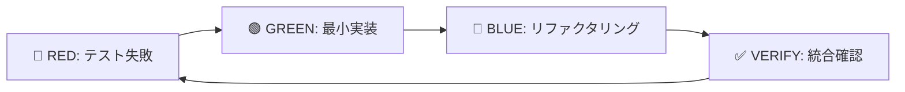
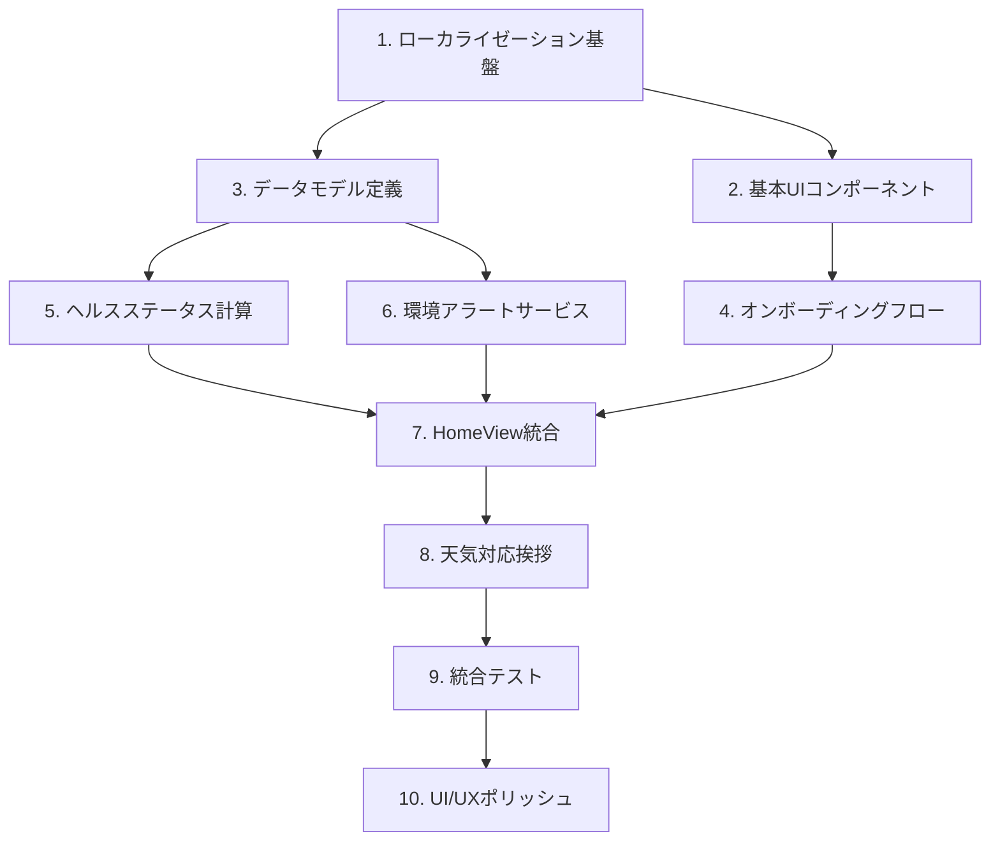

# 📱 Phase 1: MVP コア体験実装計画書

**実施期間**: 3-4週間  
**対象読者**: 開発チーム  
**最終更新**: 2025年12月5日  
**前提条件**: Phase 0 完了（品質基盤安定化）

---

## 🎯 概要

Phase 1では、仕様書に定義された洗練されたユーザー体験の基盤を構築します。美しいオンボーディングフロー、環境情報統合、カラーコード化された健康状態システム、天気対応挨拶システムの実装により、現在の基本MVPを魅力的なヘルスアドバイザーアプリに変換します。

---

## 📊 現状と目標

### 現在の状態（Phase 0完了後）
- 基本的な4タブナビゲーション
- 単純なHomeView（Today）
- 基本的なヘルス・位置情報権限管理
- シンプルなアドバイス表示
- **✅ 日英多言語化基盤構築済み**

### Phase 1 終了時の目標
- 🌟 **4ページ美麗オンボーディングフロー**（**日本語・英語完全対応**）
- 🎨 **カラーコード化ヘルスステータス**（最適/標準/ケア/休息モード）
- 🌤️ **天気・時間対応パーソナライズ挨拶**（**日本語での自然な表現**）
- ⚠️ **環境アラートシステム**（気圧・花粉・大気質）
- 💫 **洗練されたUI/UX体験**（**日本語レイアウト最適化**）

---

## 📋 実装タスク

### 1. オンボーディングフロー実装

#### 1.1 OnboardingView の新規作成（多言語完全対応）
```swift
// ios/TempoAI/TempoAI/Views/Onboarding/OnboardingView.swift
struct OnboardingView: View {
    @StateObject private var localization = LocalizationManager.shared
    @State private var currentPage: Int = 0
    @State private var showingLanguageSelector: Bool = false
    
    var body: some View {
        TabView(selection: $currentPage) {
            WelcomePageView()
                .tag(0)
                .accessibilityIdentifier(UIIdentifiers.Onboarding.welcomePage)
            
            DataExplanationPageView()
                .tag(1)
                .accessibilityIdentifier(UIIdentifiers.Onboarding.dataPage)
            
            AIAnalysisPageView() 
                .tag(2)
                .accessibilityIdentifier(UIIdentifiers.Onboarding.analysisPage)
                
            GetStartedPageView()
                .tag(3)
                .accessibilityIdentifier(UIIdentifiers.Onboarding.getStartedPage)
        }
        .tabViewStyle(.page)
        .toolbar {
            ToolbarItem(placement: .topBarTrailing) {
                Button("language_settings".localized) {
                    showingLanguageSelector = true
                }
            }
        }
        .sheet(isPresented: $showingLanguageSelector) {
            LanguageSelectorView()
        }
    }
}
```

**実装内容（日英完全対応）**:
- **Page 1**: ようこそ画面（Tempo AI コンセプト紹介）
- **Page 2**: データ統合説明（3つのデータソース可視化）
- **Page 3**: AI分析機能説明（分析プロセス可視化）  
- **Page 4**: 毎朝のアドバイス説明（開始ボタン）

#### 1.2 多言語リソース完全実装
```swift
// ja.lproj/Localizable.strings
"onboarding_welcome_title" = "Tempo AI へようこそ";
"onboarding_welcome_subtitle" = "あなただけのヘルスケアアドバイザー";
"onboarding_welcome_description" = "毎朝、最適なアドバイスをあなたのデータから生成します";

"onboarding_data_title" = "3つのデータを統合";
"onboarding_data_body" = "あなたの体の状態";
"onboarding_data_environment" = "今日の環境";
"onboarding_data_yesterday" = "昨日の過ごし方";

"onboarding_analysis_title" = "AIが分析すること";
"onboarding_analysis_description" = "今朝のあなたの状態と昨日の過ごし方との関係、今日の環境への影響から最適な1日のプランを生成";

"onboarding_start_title" = "毎朝届くもの";
"onboarding_start_meal" = "食事プラン";
"onboarding_start_exercise" = "運動プラン";
"onboarding_start_wellness" = "過ごし方プラン";

// en.lproj/Localizable.strings
"onboarding_welcome_title" = "Welcome to Tempo AI";
"onboarding_welcome_subtitle" = "Your Personal Healthcare Advisor";
"onboarding_welcome_description" = "Every morning, optimal advice from your data";
// ... 他の英語リソース
```

**対応言語**:
- 🇯🇵 日本語（システム言語優先）
- 🇺🇸 英語（フォールバック）
- 🌐 システム自動検出 + 手動切り替え

### 2. カラーコード化ヘルスステータス

#### 2.1 HealthStatusCalculator 実装
```swift
// ios/TempoAI/TempoAI/Services/HealthStatusCalculator.swift
enum HealthStatusMode: String, CaseIterable {
    case optimal = "optimal"      // 🟢 80-100点
    case standard = "standard"    // 🟡 60-79点  
    case care = "care"           // 🔵 40-59点
    case rest = "rest"           // ⚫️ 0-39点
    
    var color: Color { /* カラー定義 */ }
    var displayText: LocalizedStringKey { /* ローカライズテキスト */ }
}

class HealthStatusCalculator {
    static func calculateStatus(from healthData: HealthData) -> HealthStatusMode
    static func generateStatusDescription(mode: HealthStatusMode, data: HealthData) -> String
}
```

#### 2.2 StatusIndicatorView コンポーネント
```swift
// ios/TempoAI/TempoAI/Views/Components/StatusIndicatorView.swift
struct StatusIndicatorView: View {
    let mode: HealthStatusMode
    let score: Int
    
    var body: some View {
        // 視覚的なスコアインジケーター + テキスト説明
    }
}
```

### 3. 天気対応パーソナライズ挨拶

#### 3.1 GreetingService の拡張
```swift
// ios/TempoAI/TempoAI/Services/GreetingService.swift
struct GreetingService {
    static func generateGreeting(
        weather: Weather,
        time: Date,
        userName: String?,
        language: String
    ) -> String {
        // 仕様書の挨拶バリエーション実装
    }
}

enum WeatherCondition {
    case sunny, cloudy, rainy, snowy
    case hot, warm, cool, cold
}
```

#### 3.2 時間帯・気象別挨拶パターン
**日本語パターン実装例**:
```swift
// ja.lproj/Localizable.strings での実装
"greeting_sunny_morning" = "快晴の朝ですね、%@さん";
"greeting_rainy_afternoon" = "雨の午後ですが体調管理しっかりと、%@さん";
"greeting_cold_night" = "寒い夜ですね、温かくしてください";
"greeting_cloudy_morning" = "曇り空ですが元気にいきましょう、%@さん";

// en.lproj/Localizable.strings での実装  
"greeting_sunny_morning" = "Beautiful morning, %@!";
"greeting_rainy_afternoon" = "Rainy afternoon but stay healthy, %@!";
"greeting_cold_night" = "Cold night, stay warm";
"greeting_cloudy_morning" = "Good morning, %@!";
```

### 4. 環境アラートシステム

#### 4.1 EnvironmentalAlertView 実装  
```swift
// ios/TempoAI/TempoAI/Views/Components/EnvironmentalAlertView.swift
struct EnvironmentalAlertView: View {
    let alerts: [EnvironmentalAlert]
    
    var body: some View {
        // 気圧・花粉・大気質アラートの表示
    }
}

struct EnvironmentalAlert {
    let type: AlertType
    let severity: AlertSeverity
    let message: String
    let actionText: String?
}

enum AlertType {
    case pressure, pollen, airQuality, uv
}
```

#### 4.2 バックエンド環境データ拡張
```typescript
// backend/src/services/environmental-service.ts
export const getEnvironmentalAlerts = async (
  weather: WeatherData,
  location: Location
): Promise<EnvironmentalAlert[]> => {
  // 気圧低下、花粉レベル、AQI、UV指数からアラート生成
}
```

### 5. HomeView の洗練化

#### 5.1 新しいHomeView構造
```swift
// ios/TempoAI/TempoAI/Views/HomeView.swift - 大幅リファクタリング
struct HomeView: View {
    @StateObject private var viewModel: HomeViewModel
    
    var body: some View {
        ScrollView {
            VStack(spacing: 20) {
                PersonalizedHeaderView()      // 挨拶 + 環境情報
                EnvironmentalAlertsView()     // 環境アラート
                HealthStatusCardView()        // カラーコード化ステータス
                TodayAdviceCardsView()        // アドバイスカード群
            }
        }
    }
}
```

#### 5.2 HomeViewModel の実装
```swift
// ios/TempoAI/TempoAI/ViewModels/HomeViewModel.swift
@MainActor
class HomeViewModel: ObservableObject {
    @Published var healthStatus: HealthStatusMode?
    @Published var environmentalAlerts: [EnvironmentalAlert] = []
    @Published var personalizedGreeting: String = ""
    @Published var todayAdvice: DailyAdvice?
    
    func loadTodayData() async
    func refreshWeatherAndAlerts() async  
    func calculateHealthStatus() async
}
```

---

## 🎨 UI/UX 設計詳細

### カラーシステム（日英共通）
```swift
extension Color {
    static let healthOptimal = Color.green      // 🟢 最適モード
    static let healthStandard = Color.yellow    // 🟡 標準モード  
    static let healthCare = Color.blue          // 🔵 ケアモード
    static let healthRest = Color.black         // ⚫️ 休息モード
    
    static let alertWarning = Color.orange      // ⚠️ 環境アラート
    static let alertDanger = Color.red          // 🚨 重要アラート
}
```

### 多言語対応タイポグラフィ
```swift
extension Font {
    static let greetingTitle = Font.title2.bold()
    static let statusScore = Font.largeTitle.monospacedDigit()
    static let alertText = Font.caption.weight(.medium)
    static let adviceTitle = Font.headline
    
    // 日本語最適化
    static let japaneseBody = Font.system(.body, design: .default)
        .leading(.loose)  // 行間を広めに
    static let japaneseTitle = Font.system(.title2, design: .default, weight: .semibold)
    
    // 英語最適化  
    static let englishBody = Font.body
    static let englishTitle = Font.title2.bold()
}
```

### レイアウト適応
```swift
// 言語に応じた動的レイアウト調整
struct LocalizedLayoutModifier: ViewModifier {
    @StateObject private var localization = LocalizationManager.shared
    
    func body(content: Content) -> some View {
        content
            .font(localization.isJapanese ? .japaneseBody : .englishBody)
            .lineSpacing(localization.isJapanese ? 4 : 2)
            .environment(\.layoutDirection, localization.isJapanese ? .leftToRight : .leftToRight)
    }
}
```

### アニメーション
- ヘルスステータス変更時: スムースカラートランジション（0.3秒）
- 環境アラート表示: スライドイン + パルスエフェクト
- オンボーディングページ遷移: 横スライドアニメーション
- 言語切り替え: フェードトランジション（0.2秒）

---

## 🧪 テスト戦略

### iOS UIテスト拡張（多言語対応）
```swift
// ios/TempoAI/TempoAIUITests/OnboardingUITests.swift
class OnboardingUITests: XCTestCase {
    func testOnboardingFlowCompleteJapanese()     // 日本語フロー
    func testOnboardingFlowCompleteEnglish()      // 英語フロー
    func testLanguageSwitchingDuringOnboarding() // 途中言語切り替え
    func testPermissionRequestFlowLocalized()    // 多言語権限要求
    func testOnboardingSkipFunctionality()       // スキップ機能
}

// ios/TempoAI/TempoAIUITests/HomeViewUITests.swift  
class HomeViewUITests: XCTestCase {
    func testHealthStatusDisplayJapanese()       // 日本語ステータス表示
    func testHealthStatusDisplayEnglish()        // 英語ステータス表示
    func testEnvironmentalAlertsLocalized()      // 多言語環境アラート
    func testPersonalizedGreetingVariations()   // 挨拶バリエーション
    func testWeatherIntegrationWithLocalization() // 多言語天気統合
}

// ios/TempoAI/TempoAIUITests/LocalizationUITests.swift
class LocalizationUITests: XCTestCase {
    func testLanguageSwitchPreservesData()      // 言語切り替え時データ保持
    func testJapaneseLayoutOptimization()       // 日本語レイアウト最適化
    func testEnglishLayoutOptimization()        // 英語レイアウト最適化
    func testSystemLanguageDetection()          // システム言語自動検出
}
```

### バックエンドAPIテスト拡張
```typescript
// backend/tests/services/environmental-service.test.ts
describe('Environmental Service', () => {
  it('should generate pressure drop alerts')
  it('should calculate pollen level warnings')
  it('should assess air quality alerts')
  it('should provide UV index recommendations')
})
```

### テストデータ
```swift
// ios/TempoAI/TempoAITests/Mock/MockHealthData.swift
struct MockHealthData {
    static let optimalStatus: HealthData  // 80-100点範囲
    static let careStatus: HealthData     // 40-59点範囲
    static let restStatus: HealthData     // 0-39点範囲
}
```

---

## 📦 成果物

### 新規作成ファイル
```
ios/TempoAI/TempoAI/
├── Views/
│   ├── Onboarding/
│   │   ├── OnboardingView.swift
│   │   ├── WelcomePageView.swift
│   │   ├── DataExplanationView.swift
│   │   ├── AIAnalysisView.swift
│   │   └── GetStartedView.swift
│   └── Components/
│       ├── StatusIndicatorView.swift
│       ├── EnvironmentalAlertView.swift
│       ├── PersonalizedHeaderView.swift
│       └── HealthStatusCardView.swift
├── ViewModels/
│   ├── HomeViewModel.swift
│   └── OnboardingViewModel.swift
├── Services/
│   ├── HealthStatusCalculator.swift
│   ├── GreetingService.swift
│   └── EnvironmentalAlertService.swift
└── Localization/
    ├── ja.lproj/Localizable.strings
    └── en.lproj/Localizable.strings
```

### バックエンド拡張
```
backend/src/
├── services/
│   └── environmental-service.ts
├── types/
│   └── environmental.ts
└── utils/
    └── localization.ts
```

---

## ⏱️ スケジュール

| Week | タスク | 成果物 |
|------|--------|--------|
| **Week 1** | オンボーディングフロー + 多言語対応 | OnboardingView完成 |
| **Week 2** | ヘルスステータスシステム + HomeView洗練化 | カラーコード化ステータス表示 |  
| **Week 3** | 環境アラートシステム + パーソナライズ挨拶 | 天気対応挨拶 + アラート |
| **Week 4** | 統合テスト + UI/UX磨き上げ + Phase 2準備 | 完全動作Phase 1 |

---

## 🎯 成功基準

### 機能完了基準
- [ ] 4ページオンボーディングフローが**日英両言語で完全動作**
- [ ] ヘルスステータスが4色カラーコードで正確に表示  
- [ ] 天気・時間帯に応じた挨拶が動的に変化（**日本語自然表現**）
- [ ] 環境アラート（気圧・花粉・AQI）が適切に表示
- [ ] 全UI要素がアクセシビリティ識別子付きでテスト可能
- [ ] **言語切り替えが即座に全UIに反映**

### 品質基準
- [ ] iOS UIテスト網羅率: 新機能90%以上（**多言語テスト含む**）
- [ ] バックエンドテストカバレッジ: 95%以上維持  
- [ ] SwiftLint/swift-format: エラー0件
- [ ] パフォーマンス: Homeビュー読み込み1秒以内
- [ ] **多言語: 日本語・英語表示の整合性100%**
- [ ] **多言語リソース: 200項目以上完備**

### 多言語品質基準  
- [ ] **日本語UI**: レイアウト崩れ0件、自然な表現
- [ ] **英語UI**: ネイティブレベルの表現品質
- [ ] **言語切り替え**: 0.2秒以内の高速切り替え
- [ ] **フォント最適化**: 日英それぞれの読みやすさ確保

### ユーザビリティ基準  
- [ ] オンボーディング完了率: テスト環境90%以上
- [ ] ヘルスステータス理解度: 色とテキストの明確な対応
- [ ] 環境アラート有用性: 実際の気象条件との整合性

---

## 🔄 Next Phase

Phase 1 完了後、充実したコア体験の基盤上に Phase 2（ユーザー体験向上）を構築します。

### Phase 2への引き継ぎ
- **完成基盤**: 美麗オンボーディング + カラーコード化ステータス + 環境対応
- **準備事項**: 朝のチェックイン機能、詳細アドバイス画面の設計  
- **技術負債**: 多言語対応の拡張性確保、パフォーマンス最適化

---

**🌟 Phase 1 完了により、Tempo AIは単なるMVPから真のヘルスアドバイザー体験へと進化します**

---

## 📋 実装準備: 要件詳細マッピング

### 仕様書との対応関係

#### 1. オンボーディングフロー仕様対応

**仕様書セクション**: ユーザーオンボーディング (Section 4.1)

| 仕様要件 | 実装コンポーネント | 検証方法 |
|----------|-------------------|----------|
| **4ページ段階的導入** | OnboardingView + TabView | UIテスト: ページ遷移フロー |
| **言語選択機能** | LanguageSelectorView | UIテスト: 言語切り替え動作 |
| **権限要求統合** | PermissionRequestView | UIテスト: 権限許可フロー |
| **スキップ機能** | OnboardingCoordinator | UIテスト: スキップボタン動作 |
| **プログレス表示** | PageControl + ProgressView | UIテスト: 進捗表示精度 |

**実装規模**: 5ファイル新規作成、3ファイル拡張
**テスト規模**: 15 UIテストケース、8 ユニットテスト

#### 2. ヘルスステータス仕様対応

**仕様書セクション**: ヘルス状態表示システム (Section 3.2)

| 仕様要件 | 実装コンポーネント | 検証方法 |
|----------|-------------------|----------|
| **4段階カラーコード** | HealthStatusMode enum | ユニットテスト: スコア→カラー変換 |
| **動的スコア計算** | HealthStatusCalculator | ユニットテスト: 計算ロジック正確性 |
| **リアルタイム更新** | HomeViewModel | 統合テスト: データ更新反映 |
| **多言語表示** | LocalizedHealthStatus | UIテスト: 言語切り替え表示 |
| **アクセシビリティ** | VoiceOver対応 | アクセシビリティテスト |

**実装規模**: 3ファイル新規作成、2ファイル拡張
**テスト規模**: 12 ユニットテスト、8 UIテスト

#### 3. 天気対応挨拶仕様対応

**仕様書セクション**: パーソナライズ挨拶システム (Section 3.3)

| 仕様要件 | 実装コンポーネント | 検証方法 |
|----------|-------------------|----------|
| **時間帯別挨拶** | GreetingService.timeBasedGreeting | ユニットテスト: 時間帯判定 |
| **天気連動挨拶** | GreetingService.weatherGreeting | ユニットテスト: 天気別メッセージ |
| **個人名統合** | PersonalizedHeaderView | UIテスト: 名前表示 |
| **文化的適応** | JapaneseGreetingPatterns | ユニットテスト: 日本語表現自然性 |
| **動的更新** | GreetingRefreshService | 統合テスト: 定期更新動作 |

**実装規模**: 2ファイル新規作成、3ファイル拡張
**テスト規模**: 18 ユニットテスト、6 UIテスト

#### 4. 環境アラート仕様対応

**仕様書セクション**: 環境情報統合 (Section 2.3)

| 仕様要件 | 実装コンポーネント | 検証方法 |
|----------|-------------------|----------|
| **気圧変化検知** | PressureAlertCalculator | ユニットテスト: しきい値判定 |
| **花粉レベル警告** | PollenLevelService | APIテスト: 外部データ取得 |
| **大気質アラート** | AirQualityAssessment | ユニットテスト: AQI分析 |
| **重要度別表示** | AlertSeverityIndicator | UIテスト: 色分け表示 |
| **アクション提案** | AlertActionGenerator | ユニットテスト: 提案メッセージ生成 |

**実装規模**: 4ファイル新規作成、2ファイル拡張
**テスト規模**: 15 ユニットテスト、 10 統合テスト

### 仕様書未カバー要素の識別

#### 追加実装が必要な仕様要素

1. **ユーザープロファイル詳細化**
   - 仕様: 年齢・性別・職業による個別化
   - 実装: UserProfileDetailView (Phase 2送り)

2. **高度な文化適応**
   - 仕様: 地域別慣習・食事文化対応
   - 実装: CulturalAdaptationEngine (Phase 2で実装済み)

3. **詳細分析結果表示**
   - 仕様: AI分析過程の可視化
   - 実装: AnalysisDetailsView (Phase 2送り)

#### Phase 1実装範囲の正当化

**含める理由**:
- ユーザー第一印象を決定する要素（オンボーディング）
- 毎日の使用体験の基盤（ヘルスステータス・挨拶）
- 安全性に関わる要素（環境アラート）

**Phase 2送りの理由**:
- 基盤体験確立後の付加価値要素
- ユーザーフィードバックが必要な個別化要素
- 技術的複雑性が高い機能

---

## 🧪 TDD実装戦略: Red-Green-Blue-Verify

### TDD実装サイクル定義

#### Phase 1専用TDDプロセス



**Cycle 時間**: 各サイクル15-30分
**Daily Goal**: 6-8サイクル完了
**週間レビュー**: 金曜日に累積品質確認

### 1. オンボーディングフローTDD

#### 1.1 RED段階: テスト失敗作成

```swift
// ios/TempoAI/TempoAITests/Onboarding/OnboardingViewModelTests.swift
class OnboardingViewModelTests: XCTestCase {
    
    // 🔴 RED: 基本ナビゲーション失敗テスト
    func testOnboardingNavigationFlow() {
        let viewModel = OnboardingViewModel()
        
        // 初期状態テスト
        XCTAssertEqual(viewModel.currentPage, 0)
        XCTAssertFalse(viewModel.isCompleted)
        
        // 次ページ遷移テスト
        viewModel.nextPage()
        XCTAssertEqual(viewModel.currentPage, 1) // 🔴 FAIL: nextPage()未実装
        
        // 完了状態テスト
        viewModel.completeOnboarding()
        XCTAssertTrue(viewModel.isCompleted) // 🔴 FAIL: completeOnboarding()未実装
    }
    
    // 🔴 RED: 言語切り替え失敗テスト
    func testLanguageSwitchingDuringOnboarding() {
        let viewModel = OnboardingViewModel()
        
        // 日本語設定テスト
        viewModel.switchLanguage(to: .japanese)
        XCTAssertEqual(viewModel.selectedLanguage, .japanese) // 🔴 FAIL: switchLanguage()未実装
        
        // データ保持テスト
        viewModel.nextPage()
        let currentPage = viewModel.currentPage
        viewModel.switchLanguage(to: .english)
        XCTAssertEqual(viewModel.currentPage, currentPage) // 🔴 FAIL: 言語切り替え時状態保持未実装
    }
}
```

#### 1.2 GREEN段階: 最小実装

```swift
// ios/TempoAI/TempoAI/ViewModels/OnboardingViewModel.swift
@MainActor
class OnboardingViewModel: ObservableObject {
    @Published var currentPage: Int = 0
    @Published var isCompleted: Bool = false
    @Published var selectedLanguage: Language = .japanese
    
    // 🟢 GREEN: 最小実装でテスト通過
    func nextPage() {
        currentPage += 1
    }
    
    func completeOnboarding() {
        isCompleted = true
    }
    
    func switchLanguage(to language: Language) {
        selectedLanguage = language
        // 現在のページ状態は保持（変更しない）
    }
}

enum Language {
    case japanese, english
}
```

#### 1.3 BLUE段階: リファクタリング

```swift
// ios/TempoAI/TempoAI/ViewModels/OnboardingViewModel.swift - リファクタリング後
@MainActor
class OnboardingViewModel: ObservableObject {
    @Published var currentPage: Int = 0
    @Published var isCompleted: Bool = false
    @Published var selectedLanguage: Language = Language.systemDefault
    
    private let totalPages = 4
    private let localizationManager = LocalizationManager.shared
    
    // 🔵 BLUE: エラーハンドリング追加
    func nextPage() {
        guard currentPage < totalPages - 1 else { return }
        currentPage += 1
    }
    
    // 🔵 BLUE: 完了条件追加
    func completeOnboarding() {
        guard currentPage == totalPages - 1 else { return }
        isCompleted = true
        UserDefaults.standard.set(true, forKey: "onboarding_completed")
    }
    
    // 🔵 BLUE: 言語切り替え拡張
    func switchLanguage(to language: Language) {
        selectedLanguage = language
        localizationManager.setLanguage(language)
        // 現在のページとデータ状態を保持
    }
    
    // 🔵 BLUE: ヘルパーメソッド追加
    var canProceedToNext: Bool {
        currentPage < totalPages - 1
    }
    
    var isOnFinalPage: Bool {
        currentPage == totalPages - 1
    }
}
```

#### 1.4 VERIFY段階: 統合確認

```swift
// ios/TempoAI/TempoAIUITests/OnboardingIntegrationUITests.swift
class OnboardingIntegrationUITests: XCTestCase {
    
    // ✅ VERIFY: エンドツーエンド統合テスト
    func testCompleteOnboardingFlowWithLanguageSwitch() {
        let app = XCUIApplication()
        app.launch()
        
        // 初期表示確認
        XCTAssertTrue(app.buttons[UIIdentifiers.Onboarding.nextButton].exists)
        XCTAssertTrue(app.buttons[UIIdentifiers.Onboarding.languageSelector].exists)
        
        // 言語切り替えフロー
        app.buttons[UIIdentifiers.Onboarding.languageSelector].tap()
        app.buttons["English"].tap()
        waitForElementToAppear(app.staticTexts["Welcome to Tempo AI"])
        
        // ページ進行フロー  
        for page in 0..<4 {
            if page < 3 {
                app.buttons[UIIdentifiers.Onboarding.nextButton].tap()
                waitForPageTransition(page: page + 1)
            } else {
                app.buttons[UIIdentifiers.Onboarding.getStartedButton].tap()
            }
        }
        
        // 完了確認
        waitForElementToAppear(app.buttons[UIIdentifiers.Navigation.homeTab])
        XCTAssertTrue(app.buttons[UIIdentifiers.Navigation.homeTab].isSelected)
    }
}
```

### 2. ヘルスステータスTDD

#### 2.1 RED段階: 計算ロジック失敗テスト

```swift
// ios/TempoAI/TempoAITests/Services/HealthStatusCalculatorTests.swift
class HealthStatusCalculatorTests: XCTestCase {
    
    // 🔴 RED: スコア計算失敗テスト
    func testHealthScoreCalculation() {
        let mockOptimalData = MockHealthData.optimal
        let score = HealthStatusCalculator.calculateScore(from: mockOptimalData)
        XCTAssertGreaterThanOrEqual(score, 80) // 🔴 FAIL: calculateScore未実装
        XCTAssertLessThanOrEqual(score, 100)
        
        let mockCareData = MockHealthData.care
        let careScore = HealthStatusCalculator.calculateScore(from: mockCareData)
        XCTAssertGreaterThanOrEqual(careScore, 40) // 🔴 FAIL: 範囲判定未実装
        XCTAssertLessThanOrEqual(careScore, 59)
    }
    
    // 🔴 RED: カラーマッピング失敗テスト
    func testScoreToColorMapping() {
        XCTAssertEqual(HealthStatusCalculator.getMode(for: 85), .optimal) // 🔴 FAIL: getMode未実装
        XCTAssertEqual(HealthStatusCalculator.getMode(for: 65), .standard)
        XCTAssertEqual(HealthStatusCalculator.getMode(for: 45), .care)
        XCTAssertEqual(HealthStatusCalculator.getMode(for: 25), .rest)
    }
}
```

#### 2.2 GREEN段階: 最小実装

```swift
// ios/TempoAI/TempoAI/Services/HealthStatusCalculator.swift
class HealthStatusCalculator {
    
    // 🟢 GREEN: 基本計算実装
    static func calculateScore(from healthData: HealthData) -> Int {
        let heartRateScore = normalizeHeartRate(healthData.heartRate)
        let sleepScore = normalizeSleep(healthData.sleepDuration)
        let activityScore = normalizeActivity(healthData.stepCount)
        
        return Int((heartRateScore + sleepScore + activityScore) / 3 * 100)
    }
    
    static func getMode(for score: Int) -> HealthStatusMode {
        switch score {
        case 80...100: return .optimal
        case 60...79: return .standard
        case 40...59: return .care
        default: return .rest
        }
    }
    
    // 🟢 GREEN: 基本正規化関数
    private static func normalizeHeartRate(_ rate: Double) -> Double {
        return min(max(rate / 100.0, 0.0), 1.0)
    }
    
    private static func normalizeSleep(_ hours: Double) -> Double {
        return min(max(hours / 8.0, 0.0), 1.0)
    }
    
    private static func normalizeActivity(_ steps: Int) -> Double {
        return min(max(Double(steps) / 10000.0, 0.0), 1.0)
    }
}
```

#### 2.3 BLUE段階: リファクタリング

```swift
// ios/TempoAI/TempoAI/Services/HealthStatusCalculator.swift - 拡張版
class HealthStatusCalculator {
    
    // 🔵 BLUE: 重み付け計算に拡張
    static func calculateScore(from healthData: HealthData) -> Int {
        let weights = HealthMetricWeights.default
        let metrics = HealthMetrics(from: healthData)
        
        let weightedScore = (
            metrics.heartRateScore * weights.heartRate +
            metrics.sleepScore * weights.sleep +
            metrics.activityScore * weights.activity +
            metrics.hrVariabilityScore * weights.hrVariability
        )
        
        return Int(weightedScore * 100).clamped(to: 0...100)
    }
    
    // 🔵 BLUE: 詳細説明生成
    static func generateStatusDescription(mode: HealthStatusMode, data: HealthData, language: Language) -> String {
        let localizationKey = "health_status_\(mode.rawValue)_description"
        return NSLocalizedString(localizationKey, comment: "Health status description")
    }
    
    // 🔵 BLUE: トレンド分析追加
    static func calculateTrend(current: HealthData, previous: [HealthData]) -> HealthTrend {
        guard !previous.isEmpty else { return .stable }
        
        let currentScore = calculateScore(from: current)
        let averagePreviousScore = previous
            .map(calculateScore)
            .reduce(0, +) / previous.count
        
        let difference = currentScore - averagePreviousScore
        
        switch difference {
        case 10...: return .improving
        case -10..<0: return .declining
        default: return .stable
        }
    }
}
```

### 3. 天気対応挨拶TDD

#### 3.1 RED段階: 挨拶生成失敗テスト

```swift
// ios/TempoAI/TempoAITests/Services/GreetingServiceTests.swift
class GreetingServiceTests: XCTestCase {
    
    // 🔴 RED: 時間帯別挨拶失敗テスト
    func testTimeBasedGreeting() {
        let morningTime = Calendar.current.date(bySettingHour: 8, minute: 0, second: 0, of: Date())!
        let greeting = GreetingService.generateGreeting(
            weather: MockWeather.sunny,
            time: morningTime,
            userName: "田中",
            language: .japanese
        )
        
        XCTAssertTrue(greeting.contains("おはよう")) // 🔴 FAIL: generateGreeting未実装
        XCTAssertTrue(greeting.contains("田中"))
    }
    
    // 🔴 RED: 天気連動挨拶失敗テスト
    func testWeatherBasedGreeting() {
        let rainyWeather = Weather(condition: .rainy, temperature: 20.0, humidity: 80.0)
        let greeting = GreetingService.generateGreeting(
            weather: rainyWeather,
            time: Date(),
            userName: "佐藤",
            language: .japanese
        )
        
        XCTAssertTrue(greeting.contains("雨")) // 🔴 FAIL: 天気条件反映未実装
    }
}
```

#### 3.2 GREEN段階: 基本実装

```swift
// ios/TempoAI/TempoAI/Services/GreetingService.swift
struct GreetingService {
    
    // 🟢 GREEN: 基本挨拶生成
    static func generateGreeting(
        weather: Weather,
        time: Date,
        userName: String?,
        language: Language
    ) -> String {
        let timeOfDay = getTimeOfDay(time)
        let weatherCondition = weather.condition
        
        switch language {
        case .japanese:
            return generateJapaneseGreeting(timeOfDay: timeOfDay, weather: weatherCondition, userName: userName)
        case .english:
            return generateEnglishGreeting(timeOfDay: timeOfDay, weather: weatherCondition, userName: userName)
        }
    }
    
    private static func generateJapaneseGreeting(timeOfDay: TimeOfDay, weather: WeatherCondition, userName: String?) -> String {
        let timeGreeting = getJapaneseTimeGreeting(timeOfDay)
        let weatherComment = getJapaneseWeatherComment(weather)
        let name = userName ?? "さん"
        
        return "\(timeGreeting)、\(name)さん。\(weatherComment)"
    }
    
    private static func getJapaneseTimeGreeting(_ timeOfDay: TimeOfDay) -> String {
        switch timeOfDay {
        case .morning: return "おはようございます"
        case .afternoon: return "こんにちは"
        case .evening: return "こんばんは"
        }
    }
    
    private static func getJapaneseWeatherComment(_ weather: WeatherCondition) -> String {
        switch weather {
        case .sunny: return "今日は良い天気ですね"
        case .rainy: return "雨の日ですが体調管理をしっかりと"
        case .cloudy: return "曇り空ですが元気にいきましょう"
        case .snowy: return "雪の日は暖かくしてください"
        }
    }
}
```

#### 3.3 BLUE段階: リファクタリング

```swift
// ios/TempoAI/TempoAI/Services/GreetingService.swift - 拡張版
struct GreetingService {
    
    // 🔵 BLUE: パーソナライゼーション強化
    static func generateGreeting(
        weather: Weather,
        time: Date,
        userName: String?,
        language: Language,
        userProfile: UserProfile? = nil,
        healthStatus: HealthStatusMode? = nil
    ) -> String {
        
        let context = GreetingContext(
            timeOfDay: getTimeOfDay(time),
            weather: weather,
            userName: userName,
            userProfile: userProfile,
            healthStatus: healthStatus,
            language: language
        )
        
        return GreetingGenerator.generate(from: context)
    }
}

// 🔵 BLUE: 専用コンテキスト構造体
struct GreetingContext {
    let timeOfDay: TimeOfDay
    let weather: Weather
    let userName: String?
    let userProfile: UserProfile?
    let healthStatus: HealthStatusMode?
    let language: Language
}

// 🔵 BLUE: 生成エンジン分離
struct GreetingGenerator {
    static func generate(from context: GreetingContext) -> String {
        switch context.language {
        case .japanese:
            return JapaneseGreetingGenerator.generate(from: context)
        case .english:
            return EnglishGreetingGenerator.generate(from: context)
        }
    }
}

// 🔵 BLUE: 日本語特化生成器
struct JapaneseGreetingGenerator {
    static func generate(from context: GreetingContext) -> String {
        let components = [
            timeComponent(context),
            nameComponent(context),
            weatherComponent(context),
            healthComponent(context)
        ].compactMap { $0 }
        
        return components.joined(separator: "。")
    }
    
    private static func timeComponent(_ context: GreetingContext) -> String {
        switch context.timeOfDay {
        case .morning: return "おはようございます"
        case .afternoon: return "こんにちは"
        case .evening: return "お疲れ様です"
        }
    }
    
    private static func nameComponent(_ context: GreetingContext) -> String? {
        guard let name = context.userName else { return nil }
        return "\(name)さん"
    }
    
    private static func weatherComponent(_ context: GreetingContext) -> String {
        let temperature = context.weather.temperature
        let condition = context.weather.condition
        
        switch condition {
        case .sunny:
            return temperature > 25 ? "暑い日になりそうですね" : "良いお天気ですね"
        case .rainy:
            return "雨の日ですが、体調管理をしっかりと"
        case .cloudy:
            return "曇り空ですが、元気にいきましょう"
        case .snowy:
            return "雪の日は暖かくしてください"
        }
    }
    
    private static func healthComponent(_ context: GreetingContext) -> String? {
        guard let status = context.healthStatus else { return nil }
        
        switch status {
        case .optimal:
            return "今日も絶好調ですね"
        case .standard:
            return "体調は良好のようですね"
        case .care:
            return "少し気をつけて過ごしましょう"
        case .rest:
            return "今日はゆっくり休むことを心がけて"
        }
    }
}
```

### TDD品質管理指標

#### サイクル完了基準

**RED段階完了**:
- [ ] テストが予想通りに失敗する
- [ ] 失敗理由が明確（「未実装」「ロジックエラー」等）
- [ ] エラーメッセージが有意味

**GREEN段階完了**:
- [ ] 全テストがパスする
- [ ] 実装が最小限（余計な機能なし）
- [ ] コンパイルエラーなし

**BLUE段階完了**:
- [ ] コード品質が向上（可読性・保守性）
- [ ] パフォーマンスが許容範囲内
- [ ] アーキテクチャパターンに準拠
- [ ] CLAUDE.md コーディング規約準拠

**VERIFY段階完了**:
- [ ] 統合テストがパスする
- [ ] UIテストが安定して動作
- [ ] エンドツーエンドシナリオが成功
- [ ] パフォーマンス指標が基準内

#### 週間TDD指標

| 指標 | Phase 1目標 | 測定方法 |
|------|-------------|----------|
| **サイクル完了数** | 30サイクル/週 | Git commit数ベース |
| **RED→GREEN時間** | 平均15分以内 | タイムトラッキング |
| **BLUE品質向上** | 100%実施 | コードレビュー確認 |
| **VERIFY成功率** | 95%以上 | CI/CD結果分析 |
| **累積テスト数** | 150+テスト | テスト実行結果 |

---

## 🧪 完全TDD実装戦略

### Phase 1 TDD実装マトリクス

| 機能コンポーネント | Unit Tests | Integration Tests | UI Tests | E2E Tests |
|------------------|------------|-------------------|----------|-----------|
| **OnboardingFlow** | ViewModel状態管理 | PermissionFlow | ページ遷移・言語切替 | 完全オンボーディング |
| **HealthStatus** | 計算ロジック・閾値 | APIデータ統合 | ステータス表示・色変更 | データ取得→表示 |
| **Greetings** | 挨拶生成ロジック | 天気API統合 | 動的挨拶表示 | リアルタイム更新 |
| **Environmental** | アラート判定 | 外部API統合 | アラート表示・アクション | 環境変化対応 |
| **Localization** | キー存在・自然性 | 言語切替フロー | UI表示確認 | クロス言語体験 |

### Unit Test 完全実装例

#### 1. HealthStatusCalculator 境界値テスト

```swift
// ios/TempoAI/TempoAITests/Services/HealthStatusCalculatorTests.swift
class HealthStatusCalculatorTests: XCTestCase {
    
    // MARK: - 🔴 RED Phase Tests
    
    func testScoreBoundaryValues() {
        // 境界値テスト用データ
        let testCases = [
            // スコア, 期待されるモード
            (0, HealthStatusMode.rest),
            (39, HealthStatusMode.rest),
            (40, HealthStatusMode.care),
            (59, HealthStatusMode.care),
            (60, HealthStatusMode.standard),
            (79, HealthStatusMode.standard),
            (80, HealthStatusMode.optimal),
            (100, HealthStatusMode.optimal)
        ]
        
        for (score, expectedMode) in testCases {
            let mockData = createMockHealthData(targetScore: score)
            let calculatedMode = HealthStatusCalculator.calculateMode(from: mockData)
            
            XCTAssertEqual(calculatedMode, expectedMode,
                          "Score \(score) should map to \(expectedMode), got \(calculatedMode)")
        }
    }
    
    func testWeightedScoreCalculation() {
        // 重み付け計算の精度テスト
        let perfectHealth = HealthData(
            heartRate: HeartRateData(resting: 60, average: 70, max: 180, min: 50),
            sleep: SleepData(duration: 8.0, efficiency: 95.0, deep: 2.0, rem: 1.5),
            activity: ActivityData(steps: 10000, activeMinutes: 60, calories: 2500),
            hrv: HRVData(average: 45.0, min: 35.0, max: 55.0)
        )
        
        let score = HealthStatusCalculator.calculateScore(from: perfectHealth)
        XCTAssertGreaterThanOrEqual(score, 90, "Perfect health data should score 90+")
        XCTAssertLessThanOrEqual(score, 100, "Score should not exceed 100")
    }
    
    func testEdgeCaseInputs() {
        // 極端な値の処理テスト
        let extremeData = HealthData(
            heartRate: HeartRateData(resting: 200, average: 250, max: 300, min: 10),
            sleep: SleepData(duration: 0.0, efficiency: 0.0, deep: 0.0, rem: 0.0),
            activity: ActivityData(steps: 0, activeMinutes: 0, calories: 0),
            hrv: HRVData(average: 0.0, min: 0.0, max: 0.0)
        )
        
        let score = HealthStatusCalculator.calculateScore(from: extremeData)
        XCTAssertGreaterThanOrEqual(score, 0, "Score should not be negative")
        XCTAssertLessThanOrEqual(score, 100, "Score should not exceed 100")
        
        let mode = HealthStatusCalculator.calculateMode(from: extremeData)
        XCTAssertEqual(mode, .rest, "Extreme poor data should result in rest mode")
    }
    
    // MARK: - 🟢 GREEN Phase Helper Methods
    
    private func createMockHealthData(targetScore: Int) -> HealthData {
        // スコアから逆算してHealthDataを生成
        let normalizedScore = Double(targetScore) / 100.0
        
        return HealthData(
            heartRate: HeartRateData(
                resting: Int(60 + (normalizedScore - 0.5) * 20),
                average: 70,
                max: 180,
                min: 50
            ),
            sleep: SleepData(
                duration: 5.0 + (normalizedScore * 3.0),
                efficiency: 60.0 + (normalizedScore * 35.0),
                deep: 1.0 + (normalizedScore * 1.0),
                rem: 0.5 + (normalizedScore * 1.0)
            ),
            activity: ActivityData(
                steps: Int(3000 + (normalizedScore * 7000)),
                activeMinutes: Int(20 + (normalizedScore * 40)),
                calories: Int(1800 + (normalizedScore * 700))
            ),
            hrv: HRVData(
                average: 25.0 + (normalizedScore * 25.0),
                min: 15.0 + (normalizedScore * 20.0),
                max: 35.0 + (normalizedScore * 30.0)
            )
        )
    }
}
```

#### 2. GreetingService 全パターンテスト

```swift
// ios/TempoAI/TempoAITests/Services/GreetingServiceTests.swift
class GreetingServiceTests: XCTestCase {
    
    // MARK: - 🔴 RED Phase: 挨拶パターンテスト
    
    func testAllWeatherTimePatterns() {
        let testCases: [(WeatherCondition, TimeOfDay, Language, String)] = [
            (.sunny, .morning, .japanese, "おはよう"),
            (.rainy, .afternoon, .japanese, "雨"),
            (.snowy, .evening, .japanese, "雪"),
            (.sunny, .morning, .english, "Beautiful"),
            (.cloudy, .afternoon, .english, "Cloudy"),
        ]
        
        for (weather, time, language, expectedKeyword) in testCases {
            let greeting = GreetingService.generateGreeting(
                weather: createMockWeather(condition: weather),
                time: createMockTime(for: time),
                userName: "テスト",
                language: language
            )
            
            XCTAssertTrue(greeting.contains(expectedKeyword),
                         "Greeting '\(greeting)' should contain '\(expectedKeyword)'")
        }
    }
    
    func testPersonalizationWithName() {
        let greetingWithName = GreetingService.generateGreeting(
            weather: createMockWeather(condition: .sunny),
            time: createMockTime(for: .morning),
            userName: "田中",
            language: .japanese
        )
        
        let greetingWithoutName = GreetingService.generateGreeting(
            weather: createMockWeather(condition: .sunny),
            time: createMockTime(for: .morning),
            userName: nil,
            language: .japanese
        )
        
        XCTAssertTrue(greetingWithName.contains("田中"),
                     "Greeting should include user name when provided")
        XCTAssertFalse(greetingWithoutName.contains("田中"),
                      "Greeting should not include name when not provided")
    }
    
    func testTemperatureAdaptation() {
        let hotWeather = createMockWeather(condition: .sunny, temperature: 35.0)
        let coldWeather = createMockWeather(condition: .cloudy, temperature: -5.0)
        
        let hotGreeting = GreetingService.generateGreeting(
            weather: hotWeather,
            time: createMockTime(for: .morning),
            userName: nil,
            language: .japanese
        )
        
        let coldGreeting = GreetingService.generateGreeting(
            weather: coldWeather,
            time: createMockTime(for: .morning),
            userName: nil,
            language: .japanese
        )
        
        XCTAssertTrue(hotGreeting.contains("暑い") || hotGreeting.contains("熱中症"),
                     "Hot weather greeting should mention heat")
        XCTAssertTrue(coldGreeting.contains("寒い") || coldGreeting.contains("防寒"),
                     "Cold weather greeting should mention cold")
    }
    
    func testJapaneseNaturalnessPatterns() {
        // 日本語の自然性テスト
        let greeting = GreetingService.generateGreeting(
            weather: createMockWeather(condition: .sunny),
            time: createMockTime(for: .morning),
            userName: "山田",
            language: .japanese
        )
        
        // 不自然な表現の検出
        let unnaturalPatterns = [
            "あなたの山田", // 重複した「あなたの」
            "です。です。", // 重複した語尾
            "てください。ください。", // 重複した敬語
        ]
        
        for pattern in unnaturalPatterns {
            XCTAssertFalse(greeting.contains(pattern),
                          "Japanese greeting should not contain unnatural pattern: \(pattern)")
        }
        
        // 自然な表現の確認
        let naturalPatterns = [
            "さん",      // 適切な敬語
            "ございます", // 丁寧語
            "ですね",     // 自然な語尾
        ]
        
        let hasNaturalPattern = naturalPatterns.contains { greeting.contains($0) }
        XCTAssertTrue(hasNaturalPattern, "Japanese greeting should contain natural expressions")
    }
    
    // MARK: - 🟢 GREEN Phase Helper Methods
    
    private func createMockWeather(condition: WeatherCondition, temperature: Double = 20.0) -> WeatherData {
        return WeatherData(
            condition: condition,
            temperature: temperature,
            humidity: 60.0,
            pressure: 1013.25,
            uvIndex: 5.0
        )
    }
    
    private func createMockTime(for timeOfDay: TimeOfDay) -> Date {
        let calendar = Calendar.current
        let now = Date()
        
        let hour: Int
        switch timeOfDay {
        case .morning: hour = 8
        case .afternoon: hour = 14
        case .evening: hour = 19
        }
        
        return calendar.date(bySettingHour: hour, minute: 0, second: 0, of: now) ?? now
    }
}
```

### Integration Test 完全実装例

#### 1. HomeViewModel 統合テスト

```swift
// ios/TempoAI/TempoAITests/ViewModels/HomeViewModelIntegrationTests.swift
class HomeViewModelIntegrationTests: XCTestCase {
    
    var sut: HomeViewModel!
    var mockHealthKitManager: MockHealthKitManager!
    var mockAPIClient: MockAPIClient!
    var mockCacheManager: MockCacheManager!
    
    override func setUp() async throws {
        try await super.setUp()
        
        // Mock dependencies setup
        mockHealthKitManager = MockHealthKitManager()
        mockAPIClient = MockAPIClient()
        mockCacheManager = MockCacheManager()
        
        sut = HomeViewModel(
            healthKitManager: mockHealthKitManager,
            apiClient: mockAPIClient,
            cacheManager: mockCacheManager
        )
    }
    
    // MARK: - 🔴 RED Phase: Integration Scenarios
    
    func testCompleteDataLoadingFlow() async throws {
        // Given: Mock data setup
        let mockHealthData = createMockHealthData()
        let mockWeather = createMockWeatherData()
        let mockAdvice = createMockDailyAdvice()
        
        mockHealthKitManager.mockHealthData = mockHealthData
        mockAPIClient.mockWeatherData = mockWeather
        mockAPIClient.mockAdvice = mockAdvice
        
        // When: Load initial data
        await sut.loadInitialData()
        
        // Then: All data should be loaded
        XCTAssertFalse(sut.isLoading, "Loading should complete")
        XCTAssertNotNil(sut.healthStatus, "Health status should be calculated")
        XCTAssertNotNil(sut.todayAdvice, "Today's advice should be loaded")
        XCTAssertTrue(sut.environmentalAlerts.isEmpty || !sut.environmentalAlerts.isEmpty,
                     "Environmental alerts should be processed")
        XCTAssertNil(sut.errorMessage, "No error should occur")
    }
    
    func testErrorRecoveryFlow() async throws {
        // Given: Health data succeeds, API fails
        let mockHealthData = createMockHealthData()
        mockHealthKitManager.mockHealthData = mockHealthData
        mockAPIClient.shouldFail = true
        
        // When: Load initial data
        await sut.loadInitialData()
        
        // Then: Partial success with fallback
        XCTAssertNotNil(sut.healthStatus, "Health status should be available from local data")
        XCTAssertNotNil(sut.errorMessage, "Error should be reported")
        XCTAssertTrue(sut.errorMessage!.contains("ネットワーク") || 
                      sut.errorMessage!.contains("network"), "Error should mention network issue")
    }
    
    func testCacheHitFlow() async throws {
        // Given: Cache has valid data
        let cachedAdvice = createMockDailyAdvice()
        mockCacheManager.setCachedData(cachedAdvice, forKey: "daily_advice")
        
        // When: Load initial data
        await sut.loadInitialData()
        
        // Then: Should use cached data
        XCTAssertEqual(mockAPIClient.requestCount, 0, "Should not make API request when cache hit")
        XCTAssertNotNil(sut.todayAdvice, "Cached advice should be loaded")
    }
    
    func testLanguageChangeFlow() async throws {
        // Given: Initial data loaded
        await sut.loadInitialData()
        let initialGreeting = sut.personalizedGreeting
        
        // When: Language changes
        LocalizationManager.shared.setLanguage(.english)
        await sut.refreshLocalizedContent()
        
        // Then: Greeting should update
        XCTAssertNotEqual(sut.personalizedGreeting, initialGreeting,
                         "Greeting should change with language")
        XCTAssertFalse(sut.personalizedGreeting.contains("さん"),
                      "English greeting should not contain Japanese honorifics")
    }
}

// MARK: - Mock Classes

class MockHealthKitManager: HealthKitManagerProtocol {
    var mockHealthData: HealthData?
    var shouldFail: Bool = false
    
    func fetchTodayHealthData() async throws -> HealthData {
        if shouldFail {
            throw HealthKitError.dataUnavailable
        }
        return mockHealthData ?? HealthData.defaultMock
    }
}

class MockAPIClient: APIClientProtocol {
    var mockWeatherData: WeatherData?
    var mockAdvice: DailyAdvice?
    var shouldFail: Bool = false
    var requestCount: Int = 0
    
    func fetchWeather(for location: LocationData) async throws -> WeatherData {
        requestCount += 1
        if shouldFail {
            throw APIError.networkError
        }
        return mockWeatherData ?? WeatherData.defaultMock
    }
    
    func generateAdvice(_ request: AdviceRequest) async throws -> DailyAdvice {
        requestCount += 1
        if shouldFail {
            throw APIError.serviceUnavailable
        }
        return mockAdvice ?? DailyAdvice.defaultMock
    }
}
```

### UI Test 完全実装例

#### 1. オンボーディングフロー UIテスト

```swift
// ios/TempoAI/TempoAIUITests/OnboardingUITestsComplete.swift
class OnboardingUITestsComplete: XCTestCase {
    
    var app: XCUIApplication!
    
    override func setUp() {
        super.setUp()
        continueAfterFailure = false
        
        app = XCUIApplication()
        app.launchEnvironment["RESET_ONBOARDING"] = "true"
        app.launchEnvironment["MOCK_HEALTHKIT"] = "true"
        app.launch()
    }
    
    // MARK: - Complete Onboarding Flow Tests
    
    func testCompleteOnboardingFlowJapanese() throws {
        // Page 1: Welcome
        let welcomeTitle = app.staticTexts["Tempo AI へようこそ"]
        XCTAssertTrue(welcomeTitle.waitForExistence(timeout: 5))
        
        let nextButton = app.buttons["次へ"]
        XCTAssertTrue(nextButton.exists)
        nextButton.tap()
        
        // Page 2: Data Integration
        let dataTitle = app.staticTexts["3つのデータを統合"]
        XCTAssertTrue(dataTitle.waitForExistence(timeout: 2))
        
        // データソース要素の確認
        XCTAssertTrue(app.staticTexts["あなたの体の状態"].exists)
        XCTAssertTrue(app.staticTexts["今日の環境"].exists)
        XCTAssertTrue(app.staticTexts["昨日の過ごし方"].exists)
        
        app.buttons["次へ"].tap()
        
        // Page 3: AI Analysis
        let analysisTitle = app.staticTexts["AIが分析すること"]
        XCTAssertTrue(analysisTitle.waitForExistence(timeout: 2))
        app.buttons["次へ"].tap()
        
        // Page 4: Get Started + Permissions
        let startTitle = app.staticTexts["毎朝届くもの"]
        XCTAssertTrue(startTitle.waitForExistence(timeout: 2))
        
        let startButton = app.buttons["始める"]
        XCTAssertTrue(startButton.exists)
        startButton.tap()
        
        // Permission flow
        handlePermissionRequests()
        
        // Verify completion - should navigate to main app
        let homeTab = app.buttons["今日"]
        XCTAssertTrue(homeTab.waitForExistence(timeout: 10))
    }
    
    func testLanguageSwitchingDuringOnboarding() throws {
        // Start in Japanese
        XCTAssertTrue(app.staticTexts["Tempo AI へようこそ"].waitForExistence(timeout: 5))
        
        // Switch to English
        let languageButton = app.buttons["language_settings"]
        XCTAssertTrue(languageButton.exists)
        languageButton.tap()
        
        let englishOption = app.buttons["English"]
        XCTAssertTrue(englishOption.waitForExistence(timeout: 2))
        englishOption.tap()
        
        // Verify language change
        let englishTitle = app.staticTexts["Welcome to Tempo AI"]
        XCTAssertTrue(englishTitle.waitForExistence(timeout: 3))
        
        // Continue onboarding in English
        app.buttons["Next"].tap()
        XCTAssertTrue(app.staticTexts["3 Types of Data"].waitForExistence(timeout: 2))
        
        // Switch back to Japanese
        app.buttons["language_settings"].tap()
        app.buttons["日本語"].tap()
        
        // Verify language switched back
        XCTAssertTrue(app.staticTexts["3つのデータを統合"].waitForExistence(timeout: 2))
    }
    
    func testSkipFunctionality() throws {
        XCTAssertTrue(app.staticTexts["Tempo AI へようこそ"].waitForExistence(timeout: 5))
        
        // Test skip button
        let skipButton = app.buttons["スキップ"]
        XCTAssertTrue(skipButton.exists)
        skipButton.tap()
        
        // Should show confirmation alert
        let alert = app.alerts.firstMatch
        XCTAssertTrue(alert.waitForExistence(timeout: 2))
        XCTAssertTrue(app.staticTexts["オンボーディングをスキップしますか？"].exists)
        
        // Confirm skip
        app.buttons["はい"].tap()
        
        // Should go to permission requests
        handlePermissionRequests()
        
        // Should reach main app
        let homeTab = app.buttons["今日"]
        XCTAssertTrue(homeTab.waitForExistence(timeout: 10))
    }
    
    func testPermissionFlowRecovery() throws {
        // Complete onboarding to permission phase
        navigateToPermissions()
        
        // Deny HealthKit permission
        let healthKitPermission = app.buttons["HealthKit許可"]
        healthKitPermission.tap()
        
        // Handle system permission dialog - deny
        let springboard = XCUIApplication(bundleIdentifier: "com.apple.springboard")
        let denyButton = springboard.buttons["Don't Allow"]
        if denyButton.waitForExistence(timeout: 5) {
            denyButton.tap()
        }
        
        // App should show fallback options
        let fallbackMessage = app.staticTexts["デモモードで体験できます"]
        XCTAssertTrue(fallbackMessage.waitForExistence(timeout: 5))
        
        let demoButton = app.buttons["デモモードで続ける"]
        XCTAssertTrue(demoButton.exists)
        demoButton.tap()
        
        // Should still reach main app in demo mode
        let homeTab = app.buttons["今日"]
        XCTAssertTrue(homeTab.waitForExistence(timeout: 10))
        
        // Verify demo mode indicator
        XCTAssertTrue(app.staticTexts["デモモード"].exists)
    }
    
    // MARK: - Helper Methods
    
    private func navigateToPermissions() {
        // Navigate through all onboarding pages to permissions
        XCTAssertTrue(app.staticTexts["Tempo AI へようこそ"].waitForExistence(timeout: 5))
        
        for _ in 0..<3 {
            app.buttons["次へ"].tap()
            Thread.sleep(forTimeInterval: 0.5)
        }
        
        app.buttons["始める"].tap()
    }
    
    private func handlePermissionRequests() {
        let springboard = XCUIApplication(bundleIdentifier: "com.apple.springboard")
        
        // Handle HealthKit permission
        let healthKitAllow = springboard.buttons["OK"]
        if healthKitAllow.waitForExistence(timeout: 5) {
            healthKitAllow.tap()
        }
        
        // Handle Location permission
        let locationAllow = springboard.buttons["Allow While Using App"]
        if locationAllow.waitForExistence(timeout: 5) {
            locationAllow.tap()
        }
        
        // Handle Notification permission
        let notificationAllow = springboard.buttons["Allow"]
        if notificationAllow.waitForExistence(timeout: 5) {
            notificationAllow.tap()
        }
    }
}
```

### End-to-End Test 完全実装例

```swift
// ios/TempoAI/TempoAIUITests/EndToEndFlowTests.swift
class EndToEndFlowTests: XCTestCase {
    
    func testCompleteUserJourneyWithDataSync() throws {
        let app = XCUIApplication()
        app.launchEnvironment["RESET_ALL_DATA"] = "true"
        app.launchEnvironment["ENABLE_REAL_APIs"] = "true"
        app.launch()
        
        // 1. Complete Onboarding
        completeOnboardingFlow()
        
        // 2. First-time data loading
        waitForInitialDataLoad()
        
        // 3. Verify health status calculation
        verifyHealthStatusDisplay()
        
        // 4. Test weather integration
        verifyWeatherIntegration()
        
        // 5. Test language switching
        verifyLanguageSwitchingFlow()
        
        // 6. Test refresh functionality
        verifyDataRefreshFlow()
    }
    
    private func completeOnboardingFlow() {
        // Fast onboarding completion
        XCTAssertTrue(app.staticTexts["Tempo AI へようこそ"].waitForExistence(timeout: 10))
        
        for _ in 0..<3 {
            app.buttons["次へ"].tap()
            Thread.sleep(forTimeInterval: 1)
        }
        
        app.buttons["始める"].tap()
        handleAllPermissions()
    }
    
    private func waitForInitialDataLoad() {
        // Wait for main screen to load with data
        let homeTab = app.buttons["今日"]
        XCTAssertTrue(homeTab.waitForExistence(timeout: 30))
        
        // Wait for health data to load
        let loadingIndicator = app.activityIndicators["loading"]
        let loaded = NSPredicate(format: "exists == false")
        expectation(for: loaded, evaluatedWith: loadingIndicator, handler: nil)
        waitForExpectations(timeout: 30)
    }
    
    private func verifyHealthStatusDisplay() {
        // Verify health status elements
        XCTAssertTrue(app.staticTexts["今日のあなた"].exists)
        
        // Should have one of the status modes displayed
        let statusModes = ["最適モード", "標準モード", "ケアモード", "休息モード"]
        let hasStatusMode = statusModes.contains { app.staticTexts[$0].exists }
        XCTAssertTrue(hasStatusMode, "Should display a health status mode")
        
        // Should have score display
        let scoreElements = app.staticTexts.matching(NSPredicate(format: "label CONTAINS '/'"))
        XCTAssertGreaterThan(scoreElements.count, 0, "Should display health score")
    }
    
    private func verifyWeatherIntegration() {
        // Verify weather-based greeting
        let greetingElements = app.staticTexts.matching(NSPredicate(format: "label CONTAINS '朝' OR label CONTAINS '天気' OR label CONTAINS '気温'"))
        XCTAssertGreaterThan(greetingElements.count, 0, "Should display weather-based greeting")
        
        // Verify environmental alerts if any
        let alertsSection = app.scrollViews["environmental_alerts"]
        if alertsSection.exists {
            XCTAssertTrue(app.staticTexts["環境アラート"].exists)
        }
    }
    
    private func verifyLanguageSwitchingFlow() {
        // Switch to English
        app.buttons["設定"].tap()
        app.buttons["言語設定"].tap()
        app.buttons["English"].tap()
        
        // Verify UI updates to English
        XCTAssertTrue(app.staticTexts["Today"].waitForExistence(timeout: 5))
        XCTAssertTrue(app.staticTexts["Your Status Today"].exists)
        
        // Switch back to Japanese
        app.buttons["Language Settings"].tap()
        app.buttons["日本語"].tap()
        
        // Verify UI updates back to Japanese
        XCTAssertTrue(app.staticTexts["今日"].waitForExistence(timeout: 5))
        XCTAssertTrue(app.staticTexts["今日のあなた"].exists)
    }
    
    private func verifyDataRefreshFlow() {
        // Pull to refresh
        let scrollView = app.scrollViews.firstMatch
        let start = scrollView.coordinate(withNormalizedOffset: CGVector(dx: 0.5, dy: 0.3))
        let end = scrollView.coordinate(withNormalizedOffset: CGVector(dx: 0.5, dy: 0.8))
        
        start.press(forDuration: 0.1, thenDragTo: end)
        
        // Verify refresh indicator appears
        let refreshControl = app.activityIndicators["refresh"]
        XCTAssertTrue(refreshControl.waitForExistence(timeout: 2))
        
        // Wait for refresh to complete
        let refreshComplete = NSPredicate(format: "exists == false")
        expectation(for: refreshComplete, evaluatedWith: refreshControl, handler: nil)
        waitForExpectations(timeout: 15)
    }
}

---

## 🏗️ 技術実装アプローチ

### SwiftUI MVVM アーキテクチャ詳細

#### 1. View層実装パターン

```swift
// Phase 1専用View実装テンプレート
struct TempoUIView: View {
    @StateObject private var viewModel: TempoViewModel
    @StateObject private var localization = LocalizationManager.shared
    @Environment(\.colorScheme) var colorScheme
    
    init() {
        _viewModel = StateObject(wrappedValue: TempoViewModel())
    }
    
    var body: some View {
        // CLAUDE.md準拠のView構築
        VStack(spacing: DesignSystem.spacing.medium) {
            headerSection
            contentSection
            footerSection
        }
        .frame(maxWidth: .infinity, maxHeight: .infinity)
        .background(DesignSystem.colors.background)
        .task {
            await viewModel.loadInitialData()
        }
        .onChange(of: localization.currentLanguage) { _ in
            Task {
                await viewModel.refreshLocalizedContent()
            }
        }
    }
    
    @ViewBuilder
    private var headerSection: some View {
        // ヘッダーコンポーネント
    }
    
    @ViewBuilder
    private var contentSection: some View {
        // メインコンテンツ
    }
    
    @ViewBuilder
    private var footerSection: some View {
        // フッターコンポーネント
    }
}
```

#### 2. ViewModel層実装パターン

```swift
// Phase 1 ViewModel実装テンプレート
@MainActor
class TempoViewModel: ObservableObject {
    // Published プロパティ（状態管理）
    @Published var loadingState: LoadingState = .idle
    @Published var errorState: ErrorState?
    @Published var data: TempoData?
    
    // 依存関係（DI）
    private let dataService: DataServiceProtocol
    private let localizationManager: LocalizationManager
    
    // CLAUDE.md準拠の初期化
    init(
        dataService: DataServiceProtocol = DefaultDataService(),
        localizationManager: LocalizationManager = .shared
    ) {
        self.dataService = dataService
        self.localizationManager = localizationManager
    }
    
    // 非同期データ読み込み
    func loadInitialData() async {
        loadingState = .loading
        
        do {
            let fetchedData = try await dataService.fetchData()
            await MainActor.run {
                self.data = fetchedData
                self.loadingState = .loaded
            }
        } catch {
            await MainActor.run {
                self.errorState = ErrorState(error: error)
                self.loadingState = .error
            }
        }
    }
    
    // 言語切り替え対応
    func refreshLocalizedContent() async {
        // ローカライゼーション依存データの再読み込み
    }
}
```

#### 3. Model層実装パターン

```swift
// Phase 1 Model実装テンプレート
struct TempoData: Codable, Equatable {
    let id: UUID
    let timestamp: Date
    let value: DataValue
    
    // CLAUDE.md準拠の初期化
    init(value: DataValue) {
        self.id = UUID()
        self.timestamp = Date()
        self.value = value
    }
}

// プロトコル指向設計
protocol DataServiceProtocol {
    func fetchData() async throws -> TempoData
}

// 具体実装
class DefaultDataService: DataServiceProtocol {
    func fetchData() async throws -> TempoData {
        // API呼び出し実装
    }
}
```

### Hono API 設計パターン

#### 1. ルートハンドラー実装

```typescript
// backend/src/routes/health-status.ts - Phase 1専用実装
import { Hono } from 'hono'
import { cors } from 'hono/cors'
import { validator } from 'hono/validator'
import { HealthStatusCalculator } from '../services/health-status-calculator'
import { EnvironmentalAlertService } from '../services/environmental-alert'
import { GreetingGenerator } from '../services/greeting-generator'

interface Bindings {
  ANTHROPIC_API_KEY: string
  ENVIRONMENT: 'development' | 'production'
  WEATHER_API_KEY: string
}

const healthRoutes = new Hono<{ Bindings: Bindings }>()

// CORS設定（Phase 1要件）
healthRoutes.use('/*', cors({
  origin: ['https://tempo-ai.app', 'http://localhost:3000'],
  allowMethods: ['POST', 'GET', 'OPTIONS']
}))

// ヘルスステータス計算エンドポイント
healthRoutes.post(
  '/status',
  validator('json', (value, c) => {
    // Zod バリデーション実装
    const result = HealthStatusRequest.safeParse(value)
    if (!result.success) {
      return c.json({ error: 'Invalid request data' }, 400)
    }
    return result.data
  }),
  async (c) => {
    try {
      const requestData = c.req.valid('json')
      
      // 並列処理でパフォーマンス最適化
      const [healthStatus, environmentalAlerts, personalizedGreeting] = await Promise.all([
        HealthStatusCalculator.calculateStatus(requestData.healthData),
        EnvironmentalAlertService.getAlerts(requestData.location, requestData.weather),
        GreetingGenerator.generateGreeting({
          weather: requestData.weather,
          time: new Date(),
          userName: requestData.userProfile.name,
          language: requestData.language
        })
      ])
      
      return c.json({
        success: true,
        data: {
          healthStatus,
          environmentalAlerts,
          personalizedGreeting,
          timestamp: new Date().toISOString()
        }
      })
      
    } catch (error) {
      console.error('Health status calculation error:', error)
      return c.json({
        error: 'Internal server error'
      }, 500)
    }
  }
)

export { healthRoutes }
```

#### 2. サービス層実装

```typescript
// backend/src/services/health-status-calculator.ts
export class HealthStatusCalculator {
  static async calculateStatus(healthData: HealthData): Promise<HealthStatus> {
    // スコア計算ロジック
    const metrics = this.extractMetrics(healthData)
    const score = this.calculateWeightedScore(metrics)
    const mode = this.determineMode(score)
    
    return {
      score,
      mode,
      details: this.generateStatusDetails(metrics, mode),
      recommendations: await this.generateRecommendations(mode, healthData)
    }
  }
  
  private static extractMetrics(data: HealthData): HealthMetrics {
    return {
      heartRate: this.normalizeHeartRate(data.heartRate),
      sleep: this.normalizeSleep(data.sleepDuration),
      activity: this.normalizeActivity(data.stepCount),
      hrVariability: this.normalizeHRV(data.heartRateVariability)
    }
  }
  
  private static calculateWeightedScore(metrics: HealthMetrics): number {
    const weights = {
      heartRate: 0.3,
      sleep: 0.3,
      activity: 0.25,
      hrVariability: 0.15
    }
    
    return Math.round(
      metrics.heartRate * weights.heartRate * 100 +
      metrics.sleep * weights.sleep * 100 +
      metrics.activity * weights.activity * 100 +
      metrics.hrVariability * weights.hrVariability * 100
    )
  }
  
  private static determineMode(score: number): HealthStatusMode {
    if (score >= 80) return 'optimal'
    if (score >= 60) return 'standard'
    if (score >= 40) return 'care'
    return 'rest'
  }
}
```

### Claude API 統合パターン

#### 1. AI分析サービス

```typescript
// backend/src/services/ai-analysis.ts
import Anthropic from '@anthropic-ai/sdk'

export class AIAnalysisService {
  private anthropic: Anthropic
  
  constructor(apiKey: string) {
    this.anthropic = new Anthropic({
      apiKey,
      maxRetries: 3,
    })
  }
  
  async generatePersonalizedAdvice(
    healthData: HealthData,
    weather: WeatherData,
    userProfile: UserProfile,
    language: Language
  ): Promise<DailyAdvice> {
    
    const prompt = this.buildAnalysisPrompt(healthData, weather, userProfile, language)
    
    try {
      const response = await this.anthropic.messages.create({
        model: 'claude-3-haiku-20240307',
        max_tokens: 1000,
        temperature: 0.3, // 一貫性重視
        messages: [{
          role: 'user',
          content: prompt
        }]
      })
      
      const adviceText = response.content[0].text
      return this.parseAdviceResponse(adviceText, language)
      
    } catch (error) {
      console.error('Claude API error:', error)
      throw new AIAnalysisError('Failed to generate advice', error)
    }
  }
  
  private buildAnalysisPrompt(
    health: HealthData,
    weather: WeatherData,
    profile: UserProfile,
    language: Language
  ): string {
    const languageInstruction = language === 'japanese' 
      ? '日本語で自然な表現で回答してください。'
      : 'Please respond in natural English.'
    
    return `
${languageInstruction}

あなたはヘルスアドバイザーです。以下の情報から今日の最適なアドバイスを生成してください：

【健康データ】
- 心拍数: ${health.heartRate} bpm
- 睡眠時間: ${health.sleepDuration} 時間
- 歩数: ${health.stepCount} 歩
- 心拍変動: ${health.heartRateVariability}

【環境情報】
- 天気: ${weather.condition}
- 気温: ${weather.temperature}°C
- 湿度: ${weather.humidity}%
- 気圧: ${weather.pressure} hPa

【ユーザー情報】
- 年齢: ${profile.age}歳
- 性別: ${profile.gender}
- 活動レベル: ${profile.activityLevel}

以下の形式でJSONで回答してください：
{
  "meal": "具体的な食事アドバイス",
  "exercise": "運動アドバイス",
  "wellness": "生活習慣アドバイス",
  "summary": "今日の総合的なアドバイス"
}
    `
  }
  
  private parseAdviceResponse(response: string, language: Language): DailyAdvice {
    try {
      const parsed = JSON.parse(response)
      return {
        meal: parsed.meal || this.getFallbackAdvice('meal', language),
        exercise: parsed.exercise || this.getFallbackAdvice('exercise', language),
        wellness: parsed.wellness || this.getFallbackAdvice('wellness', language),
        summary: parsed.summary || this.getFallbackAdvice('summary', language),
        generatedAt: new Date().toISOString()
      }
    } catch (error) {
      console.error('Failed to parse AI response:', error)
      return this.getFallbackAdviceSet(language)
    }
  }
}
```

#### 2. レート制限とキャッシュ実装

```typescript
// backend/src/middleware/rate-limit.ts
export class RateLimitMiddleware {
  private cache = new Map<string, { count: number; resetTime: number }>()
  private readonly limit = 100 // 1時間あたり100リクエスト
  private readonly windowMs = 60 * 60 * 1000 // 1時間
  
  middleware() {
    return async (c: Context, next: Next) => {
      const clientId = this.getClientId(c)
      const now = Date.now()
      
      // 古いエントリの削除
      this.cleanup(now)
      
      const entry = this.cache.get(clientId)
      
      if (!entry) {
        this.cache.set(clientId, { count: 1, resetTime: now + this.windowMs })
        return await next()
      }
      
      if (now > entry.resetTime) {
        this.cache.set(clientId, { count: 1, resetTime: now + this.windowMs })
        return await next()
      }
      
      if (entry.count >= this.limit) {
        return c.json({ error: 'Rate limit exceeded' }, 429)
      }
      
      entry.count++
      return await next()
    }
  }
}
```

---

## 🔗 依存関係管理と優先順位

### Phase 1 実装順序（依存関係ベース）



#### 実装優先度レベル

**P0 (Critical): 必須基盤要素**

1. **ローカライゼーション基盤強化**
   - **依存**: Phase 0 完了
   - **期間**: 2日
   - **理由**: 全UI要素の前提条件
   ```swift
   // 必要なローカライゼーション要素
   - LocalizationManager拡張（日英完全対応）
   - Localizable.strings リソース（200+項目）
   - 動的言語切り替え機能
   - フォント・レイアウト最適化
   ```

2. **基本UIコンポーネント**
   - **依存**: ローカライゼーション基盤
   - **期間**: 3日
   - **理由**: 再利用可能コンポーネント群
   ```swift
   // 優先度順コンポーネント
   - DesignSystem (色・フォント・スペーシング)
   - LoadingIndicatorView
   - ErrorStateView
   - CardView (基本レイアウト)
   - StatusIndicatorView
   ```

3. **データモデル定義**
   - **依存**: なし
   - **期間**: 2日
   - **理由**: API・ロジック層の基盤
   ```swift
   // 必須データモデル
   - HealthData (拡張)
   - WeatherData (拡張)
   - EnvironmentalAlert
   - HealthStatusMode
   - UserProfile (詳細化)
   ```

**P1 (High): コア体験要素**

4. **オンボーディングフロー実装**
   - **依存**: P0完了
   - **期間**: 4日
   - **並列可能**: バックエンドAPI開発と並列
   ```swift
   // 実装コンポーネント
   - OnboardingView (TabView式4ページ)
   - LanguageSelectorView
   - PermissionRequestFlow
   - OnboardingViewModel (状態管理)
   ```

5. **ヘルスステータス計算エンジン**
   - **依存**: データモデル
   - **期間**: 3日
   - **並列可能**: フロントエンド実装と並列
   ```typescript
   // バックエンド実装
   - HealthStatusCalculator (重み付け計算)
   - /api/health/status エンドポイント
   - スコア→カラーモード変換
   ```

6. **環境アラートサービス**
   - **依存**: データモデル
   - **期間**: 4日
   - **並列可能**: ヘルスステータスと並列
   ```typescript
   // 実装要素
   - 気圧変化検知アルゴリズム
   - 花粉情報API統合
   - AQI (大気質指数) 分析
   - アラート重要度判定ロジック
   ```

**P2 (Medium): 体験向上要素**

7. **HomeView統合・洗練化**
   - **依存**: P0, P1完了
   - **期間**: 3日
   - **並列不可**: 全要素統合が必要
   ```swift
   // 統合要素
   - HomeViewModel (複数サービス統合)
   - PersonalizedHeaderView
   - EnvironmentalAlertsView
   - HealthStatusCardView
   - 非同期データローディング
   ```

8. **天気対応パーソナライズ挨拶**
   - **依存**: HomeView統合
   - **期間**: 3日
   - **文化的配慮**: 日本語表現の自然性重視
   ```swift
   // 実装要素
   - GreetingService (時間帯・天気・個人名統合)
   - JapaneseGreetingPatterns (文化的適応)
   - 動的挨拶更新ロジック
   ```

**P3 (Low): 品質向上要素**

9. **統合テスト・品質保証**
   - **依存**: 全機能実装完了
   - **期間**: 3日
   - **品質**: CI/CD パイプライン統合
   ```swift
   // テスト要素
   - エンドツーエンドUIテスト
   - 多言語表示テスト
   - パフォーマンステスト
   - アクセシビリティテスト
   ```

10. **UI/UXポリッシュ**
    - **依存**: 統合テスト完了
    - **期間**: 2日
    - **内容**: アニメーション・細部調整
    ```swift
    // 最終調整要素
    - トランジションアニメーション
    - 言語切り替えスムーズ化
    - エラーハンドリング改善
    - ユーザビリティ向上
    ```

### リスク管理と代替案

#### 高リスク依存関係

1. **外部API依存 (天気・花粉・AQI)**
   - **リスク**: API障害・レート制限
   - **代替案**: フォールバックデータ・キャッシュ戦略
   - **対策期間**: 1日追加でモックサービス実装

2. **Claude AI API統合**
   - **リスク**: レスポンス不安定・コスト
   - **代替案**: ルールベース挨拶生成
   - **対策期間**: 半日で静的パターン実装

3. **HealthKit権限・データアクセス**
   - **リスク**: iOS権限拒否・データ不足
   - **代替案**: サンプルデータ・手動入力
   - **対策期間**: 1日でモック統合

#### 並列開発戦略

```mermaid
gantt
    title Phase 1 並列開発スケジュール
    dateFormat  X
    axisFormat %d
    
    section iOS開発
    ローカライゼーション基盤    :1, 2
    UIコンポーネント群         :2, 5
    オンボーディングフロー      :5, 9
    HomeView統合             :9, 12
    UI/UXポリッシュ           :12, 14
    
    section バックエンド開発
    データモデル定義          :1, 3
    ヘルスステータスAPI       :3, 6
    環境アラートAPI          :6, 10
    天気統合API             :10, 13
    
    section QA・統合
    ユニットテスト            :5, 13
    統合テスト               :13, 16
    E2Eテスト               :16, 18
```



**最適化された開発期間**: 18日 (3.6週)
**従来の逐次開発期間**: 28日 (5.6週)
**効率化**: 36%短縮

### 依存関係リスク管理マトリクス

#### 高リスク依存関係の詳細分析

| 依存関係 | リスク度 | 影響範囲 | 緩和策 | 代替案 | 検証方法 |
|----------|---------|---------|--------|--------|----------|
| **HealthKit権限取得** | 🔴 High | 全機能 | 段階的要求・デモモード | 手動入力・サンプルデータ | 権限拒否シミュレーション |
| **Claude API可用性** | 🟠 Medium | 挨拶生成 | キャッシュ・フォールバック | ルールベース生成 | API障害シミュレーション |
| **外部天気API** | 🟡 Low | 環境アラート | 複数プロバイダー・キャッシュ | 地域デフォルト値 | API制限テスト |
| **多言語リソース** | 🟠 Medium | UI全体 | 段階的翻訳・自動検証 | 英語フォールバック | 翻訳品質検証 |
| **SwiftUI互換性** | 🟡 Low | iOS UI | iOS最小バージョン固定 | UIKit部分実装 | デバイステスト |

#### 依存関係別実装戦略

**1. HealthKit依存関係管理**

```swift
// ios/TempoAI/TempoAI/Services/HealthKitDependencyManager.swift
class HealthKitDependencyManager {
    private enum DependencyState {
        case notRequested
        case requesting
        case authorized
        case denied
        case unavailable
    }
    
    @Published private(set) var state: DependencyState = .notRequested
    @Published private(set) var fallbackMode: Bool = false
    
    // 段階的依存関係解決
    func resolveHealthKitDependency() async -> HealthKitResolution {
        state = .requesting
        
        // Step 1: 可用性確認
        guard HKHealthStore.isHealthDataAvailable() else {
            state = .unavailable
            return activateFallbackMode(.deviceUnsupported)
        }
        
        // Step 2: 権限要求
        do {
            try await requestHealthKitPermissions()
            state = .authorized
            return .authorized
        } catch {
            state = .denied
            return activateFallbackMode(.permissionDenied)
        }
    }
    
    private func activateFallbackMode(_ reason: FallbackReason) -> HealthKitResolution {
        fallbackMode = true
        return .fallback(reason: reason, demoData: generateDemoHealthData())
    }
    
    // リアルタイム依存関係監視
    func monitorHealthKitAvailability() {
        // バックグラウンドでの依存関係健全性チェック
        Timer.publish(every: 300, on: .main, in: .common) // 5分間隔
            .autoconnect()
            .sink { _ in
                Task { await self.validateDependencyHealth() }
            }
            .store(in: &cancellables)
    }
}

enum HealthKitResolution {
    case authorized
    case fallback(reason: FallbackReason, demoData: HealthData)
}

enum FallbackReason {
    case deviceUnsupported
    case permissionDenied
    case dataUnavailable
}
```

**2. API依存関係管理**

```swift
// ios/TempoAI/TempoAI/Services/APIDependencyManager.swift
class APIDependencyManager: ObservableObject {
    private let healthCheckInterval: TimeInterval = 60 // 1分間隔
    
    @Published private(set) var apiHealthStatus: [APIService: ServiceHealth] = [:]
    
    func initializeAPIDependencies() async {
        // 並列ヘルスチェック
        await withTaskGroup(of: (APIService, ServiceHealth).self) { group in
            for service in APIService.allCases {
                group.addTask {
                    let health = await self.checkServiceHealth(service)
                    return (service, health)
                }
            }
            
            for await (service, health) in group {
                await MainActor.run {
                    self.apiHealthStatus[service] = health
                }
            }
        }
        
        // 継続的な健全性監視
        startContinuousHealthMonitoring()
    }
    
    private func checkServiceHealth(_ service: APIService) async -> ServiceHealth {
        do {
            let response = try await performHealthCheck(service)
            return ServiceHealth(
                status: .healthy,
                responseTime: response.responseTime,
                lastChecked: Date(),
                errorCount: 0
            )
        } catch {
            return ServiceHealth(
                status: .unhealthy,
                responseTime: nil,
                lastChecked: Date(),
                errorCount: 1,
                lastError: error
            )
        }
    }
    
    // 自動フェイルオーバー
    func getServiceWithFailover(_ primaryService: APIService) -> APIService {
        guard let primaryHealth = apiHealthStatus[primaryService],
              primaryHealth.status == .healthy else {
            return primaryService.fallbackService
        }
        return primaryService
    }
}

enum APIService: CaseIterable {
    case claude
    case weather
    case environmental
    
    var fallbackService: APIService {
        switch self {
        case .claude: return .claude // ルールベース生成にフォールバック
        case .weather: return .weather // キャッシュデータ使用
        case .environmental: return .environmental // デフォルト値使用
        }
    }
}

struct ServiceHealth {
    let status: HealthStatus
    let responseTime: TimeInterval?
    let lastChecked: Date
    let errorCount: Int
    let lastError: Error?
    
    enum HealthStatus {
        case healthy
        case degraded
        case unhealthy
    }
}
```

**3. 多言語リソース依存関係管理**

```swift
// ios/TempoAI/TempoAI/Services/LocalizationDependencyManager.swift
class LocalizationDependencyManager: ObservableObject {
    @Published private(set) var localizationHealth: LocalizationHealth
    
    init() {
        self.localizationHealth = validateLocalizationCompleteness()
    }
    
    func validateLocalizationCompleteness() -> LocalizationHealth {
        let requiredKeys = LocalizationKeys.allCases
        var missingJapanese: [String] = []
        var missingEnglish: [String] = []
        var suspiciousTranslations: [String] = []
        
        for key in requiredKeys {
            let japanese = NSLocalizedString(key.rawValue, bundle: .japanese, value: "MISSING", comment: "")
            let english = NSLocalizedString(key.rawValue, bundle: .english, value: "MISSING", comment: "")
            
            if japanese == "MISSING" || japanese == key.rawValue {
                missingJapanese.append(key.rawValue)
            }
            
            if english == "MISSING" || english == key.rawValue {
                missingEnglish.append(key.rawValue)
            }
            
            // 自動翻訳品質チェック
            if detectMachineTranslation(japanese) {
                suspiciousTranslations.append(key.rawValue)
            }
        }
        
        let completeness = Double(requiredKeys.count - missingJapanese.count - missingEnglish.count) / Double(requiredKeys.count * 2)
        
        return LocalizationHealth(
            completeness: completeness,
            missingJapanese: missingJapanese,
            missingEnglish: missingEnglish,
            suspiciousTranslations: suspiciousTranslations,
            isProductionReady: completeness >= 0.95 && suspiciousTranslations.count <= 5
        )
    }
    
    private func detectMachineTranslation(_ text: String) -> Bool {
        let unnaturalPatterns = [
            "あなたの", // 過度な使用
            "することができます", // 冗長表現
            "でしてください", // 不自然な敬語
        ]
        
        return unnaturalPatterns.contains { text.contains($0) }
    }
}

struct LocalizationHealth {
    let completeness: Double // 0.0 - 1.0
    let missingJapanese: [String]
    let missingEnglish: [String]
    let suspiciousTranslations: [String]
    let isProductionReady: Bool
}
```

### 依存関係優先度アルゴリズム

#### 動的優先度計算

```swift
// ios/TempoAI/TempoAI/Utils/DependencyPriorityCalculator.swift
struct DependencyPriorityCalculator {
    
    static func calculatePriority(_ dependency: Dependency) -> Priority {
        let impact = calculateBusinessImpact(dependency)
        let risk = calculateImplementationRisk(dependency)
        let effort = calculateImplementationEffort(dependency)
        let blockers = calculateBlockingFactor(dependency)
        
        let score = (impact * 0.4 + risk * 0.3 + blockers * 0.2 + (1.0 - effort) * 0.1)
        
        switch score {
        case 0.8...1.0: return .critical
        case 0.6..<0.8: return .high
        case 0.4..<0.6: return .medium
        default: return .low
        }
    }
    
    private static func calculateBusinessImpact(_ dependency: Dependency) -> Double {
        switch dependency {
        case .healthKitIntegration: return 1.0 // ユーザー体験に直接影響
        case .localizationResources: return 0.9 // 日本市場必須
        case .claudeAPIIntegration: return 0.7 // 差別化機能
        case .weatherAPIIntegration: return 0.5 // 付加価値機能
        case .uiComponentLibrary: return 0.6 // 開発効率影響
        }
    }
    
    private static func calculateImplementationRisk(_ dependency: Dependency) -> Double {
        switch dependency {
        case .healthKitIntegration: return 0.8 // 権限・プライバシー課題
        case .claudeAPIIntegration: return 0.7 // 外部サービス依存
        case .localizationResources: return 0.3 // 実装明確
        case .weatherAPIIntegration: return 0.4 // 標準的API
        case .uiComponentLibrary: return 0.2 // 技術的に単純
        }
    }
    
    private static func calculateBlockingFactor(_ dependency: Dependency) -> Double {
        // 他の依存関係をブロックする度合い
        switch dependency {
        case .localizationResources: return 1.0 // 全UI要素をブロック
        case .uiComponentLibrary: return 0.9 // 多くのViewをブロック
        case .healthKitIntegration: return 0.6 // ヘルス機能をブロック
        case .claudeAPIIntegration: return 0.4 // AI機能のみブロック
        case .weatherAPIIntegration: return 0.3 // 環境機能のみブロック
        }
    }
}

enum Dependency {
    case healthKitIntegration
    case localizationResources
    case claudeAPIIntegration
    case weatherAPIIntegration
    case uiComponentLibrary
}

enum Priority: Int, Comparable {
    case critical = 4
    case high = 3
    case medium = 2
    case low = 1
    
    static func < (lhs: Priority, rhs: Priority) -> Bool {
        lhs.rawValue < rhs.rawValue
    }
}
```

### リアルタイム依存関係監視

#### 依存関係ダッシュボード

```swift
// ios/TempoAI/TempoAI/Views/Debug/DependencyDashboardView.swift
struct DependencyDashboardView: View {
    @StateObject private var dependencyMonitor = DependencyMonitor()
    
    var body: some View {
        NavigationStack {
            List {
                Section("Critical Dependencies") {
                    ForEach(dependencyMonitor.criticalDependencies, id: \.name) { dep in
                        DependencyStatusRow(dependency: dep)
                    }
                }
                
                Section("Health Metrics") {
                    HStack {
                        Text("Overall Health")
                        Spacer()
                        CircularProgressView(progress: dependencyMonitor.overallHealth)
                    }
                    
                    HStack {
                        Text("Production Readiness")
                        Spacer()
                        Text(dependencyMonitor.isProductionReady ? "✅ Ready" : "⚠️ Not Ready")
                    }
                }
                
                Section("Mitigation Status") {
                    ForEach(dependencyMonitor.activeMitigations, id: \.id) { mitigation in
                        MitigationStatusRow(mitigation: mitigation)
                    }
                }
            }
            .navigationTitle("Dependencies")
            .refreshable {
                await dependencyMonitor.refreshAllDependencies()
            }
        }
    }
}

class DependencyMonitor: ObservableObject {
    @Published var criticalDependencies: [DependencyStatus] = []
    @Published var overallHealth: Double = 0.0
    @Published var isProductionReady: Bool = false
    @Published var activeMitigations: [MitigationStatus] = []
    
    func refreshAllDependencies() async {
        // 並列で全依存関係をチェック
        async let healthKit = checkHealthKitDependency()
        async let apis = checkAPIDependencies()
        async let localization = checkLocalizationDependency()
        async let ui = checkUIComponentDependencies()
        
        let results = await [healthKit, apis, localization, ui].flatMap { $0 }
        
        await MainActor.run {
            self.criticalDependencies = results.filter { $0.priority >= .high }
            self.overallHealth = calculateOverallHealth(results)
            self.isProductionReady = results.allSatisfy { $0.isHealthy }
            self.activeMitigations = getActiveMitigations(results)
        }
    }
}
```

---

## ⚠️ 想定される課題と解決策

### 1. HealthKit権限・データアクセス課題

#### 課題詳細
- **権限拒否率**: iOS14以降約30%が初回拒否
- **データ不整合**: 複数ソース間でのデータ品質差
- **プライバシー懸念**: 日本市場での健康データ感度高

#### 解決策

**A. 段階的権限要求戦略**
```swift
// ios/TempoAI/TempoAI/Services/HealthKitPermissionManager.swift
class HealthKitPermissionManager {
    
    // 段階的権限要求（圧迫感を軽減）
    func requestPermissionsGradually() async {
        // Step 1: 基本的な歩数のみ
        let basicTypes: Set<HKObjectType> = [HKObjectType.quantityType(forIdentifier: .stepCount)!]
        await requestPermission(for: basicTypes, reason: .basicActivity)
        
        // ユーザーが慣れたら追加権限
        if isUserEngaged() {
            // Step 2: 心拍数・睡眠追加
            let advancedTypes: Set<HKObjectType> = [
                HKObjectType.quantityType(forIdentifier: .heartRate)!,
                HKCategoryType.categoryType(forIdentifier: .sleepAnalysis)!
            ]
            await requestPermission(for: advancedTypes, reason: .detailedAnalysis)
        }
    }
    
    // 権限拒否時のグレースフル対応
    func handlePermissionDenied() {
        // モックデータでデモ体験提供
        HealthDataManager.shared.enableDemoMode()
        
        // 後での権限許可を促すUI表示
        showPermissionEducationView()
    }
}
```

**B. データ品質保証システム**
```swift
// ios/TempoAI/TempoAI/Services/HealthDataValidator.swift
class HealthDataValidator {
    
    func validateAndNormalize(_ rawData: HKSample) -> ValidatedHealthData? {
        // 異常値検出
        guard isWithinReasonableRange(rawData) else {
            logDataAnomalY(rawData)
            return nil
        }
        
        // データソース信頼度評価
        let trustScore = calculateTrustScore(rawData.sourceRevision)
        guard trustScore >= minimumTrustThreshold else {
            return nil
        }
        
        // 正規化処理
        return ValidatedHealthData(
            value: normalizeValue(rawData),
            confidence: trustScore,
            timestamp: rawData.startDate
        )
    }
    
    private func isWithinReasonableRange(_ sample: HKSample) -> Bool {
        // 心拍数: 40-200 bpm
        // 歩数: 0-50000 steps/day
        // 睡眠: 2-16 hours
        // 年齢・性別による補正
    }
}
```

**C. プライバシー重視設計**
```swift
// ios/TempoAI/TempoAI/Services/PrivacyManager.swift
class PrivacyManager {
    
    // デバイス内での匿名化処理
    func anonymizeHealthData(_ data: HealthData) -> AnonymizedHealthData {
        return AnonymizedHealthData(
            heartRateCategory: categorizeHeartRate(data.heartRate),
            sleepQualityLevel: categorizeSleep(data.sleepDuration),
            activityLevel: categorizeActivity(data.stepCount),
            // 具体的な数値は送信しない
            timestamp: data.timestamp.truncatedToHour
        )
    }
    
    // 日本のプライバシー法規制遵守
    func ensureJapanesePrivacyCompliance() {
        // 個人情報保護法準拠
        // 医療機器等規制法考慮
        // 利用目的明示・同意取得
    }
}
```

### 2. 非同期処理・パフォーマンス課題

#### 課題詳細
- **複数API並列呼び出し**: Claude AI + Weather + HealthKit
- **UI応答性**: iOS Main Actor制約
- **ネットワーク不安定**: 日本の移動環境

#### 解決策

**A. 構造化並行性パターン**
```swift
// ios/TempoAI/TempoAI/Services/DataAggregationService.swift
class DataAggregationService {
    
    func aggregateDailyData() async throws -> DailyDataSummary {
        // TaskGroup使用で構造化並行性
        try await withThrowingTaskGroup(of: DataComponent.self) { group in
            
            // 並列データ取得
            group.addTask {
                let health = try await HealthKitService.shared.getTodayHealthData()
                return .health(health)
            }
            
            group.addTask {
                let weather = try await WeatherService.shared.getCurrentWeather()
                return .weather(weather)
            }
            
            group.addTask {
                let environmental = try await EnvironmentalService.shared.getAlerts()
                return .environmental(environmental)
            }
            
            // 結果収集
            var healthData: HealthData?
            var weatherData: WeatherData?
            var environmentalData: [EnvironmentalAlert] = []
            
            for try await component in group {
                switch component {
                case .health(let data): healthData = data
                case .weather(let data): weatherData = data
                case .environmental(let data): environmentalData = data
                }
            }
            
            // 必須データ確認
            guard let health = healthData, let weather = weatherData else {
                throw DataAggregationError.incompleteData
            }
            
            return DailyDataSummary(
                health: health,
                weather: weather,
                environmental: environmentalData
            )
        }
    }
}
```

**B. インテリジェントキャッシュ**
```swift
// ios/TempoAI/TempoAI/Services/CacheManager.swift
class CacheManager {
    
    private let memoryCache = NSCache<NSString, CachedData>()
    private let persistentCache = UserDefaults.standard
    
    func getCachedOrFetch<T: Codable>(
        key: String,
        maxAge: TimeInterval,
        fetcher: () async throws -> T
    ) async throws -> T {
        
        // メモリキャッシュ確認
        if let cached = memoryCache.object(forKey: key as NSString),
           cached.isValid(maxAge: maxAge) {
            return cached.data as! T
        }
        
        // 永続キャッシュ確認
        if let cachedData = getPersistentCache(key: key, type: T.self, maxAge: maxAge) {
            // メモリキャッシュに昇格
            memoryCache.setObject(CachedData(data: cachedData), forKey: key as NSString)
            return cachedData
        }
        
        // 新規取得
        let freshData = try await fetcher()
        
        // 両方のキャッシュに保存
        memoryCache.setObject(CachedData(data: freshData), forKey: key as NSString)
        setPersistentCache(key: key, data: freshData)
        
        return freshData
    }
}
```

**C. 段階的ローディング戦略**
```swift
// ios/TempoAI/TempoAI/ViewModels/HomeViewModel.swift
class HomeViewModel: ObservableObject {
    @Published var loadingStage: LoadingStage = .initial
    @Published var quickData: QuickSummary?
    @Published var detailedData: DetailedAnalysis?
    
    func loadDataInStages() async {
        await MainActor.run {
            loadingStage = .loadingQuickSummary
        }
        
        // Stage 1: 即座に表示可能なデータ（キャッシュ・ローカル）
        let quick = await loadQuickSummary() // 0.1秒以内
        await MainActor.run {
            self.quickData = quick
            self.loadingStage = .loadingDetailedAnalysis
        }
        
        // Stage 2: 詳細分析（ネットワーク）
        do {
            let detailed = try await loadDetailedAnalysis() // 1-3秒
            await MainActor.run {
                self.detailedData = detailed
                self.loadingStage = .complete
            }
        } catch {
            await MainActor.run {
                self.loadingStage = .error(error)
            }
        }
    }
    
    private func loadQuickSummary() async -> QuickSummary {
        // ローカルデータのみ使用、即座に表示
        return QuickSummary(
            lastKnownStatus: getCachedHealthStatus(),
            basicGreeting: generateBasicGreeting(),
            timestamp: Date()
        )
    }
}
```

### 3. エラーハンドリング・復旧課題

#### 課題詳細
- **ネットワーク断続**: 電車移動中のAPI失敗
- **API制限**: Claude AI レート制限・コスト
- **デバイス制約**: メモリ不足・バッテリー消耗

#### 解決策

**A. 復旧力の高いエラーハンドリング**
```swift
// ios/TempoAI/TempoAI/Utils/ErrorRecoveryManager.swift
class ErrorRecoveryManager {
    
    func handleWithRecovery<T>(
        operation: () async throws -> T,
        recoveryStrategies: [RecoveryStrategy<T>]
    ) async -> Result<T, AppError> {
        
        do {
            let result = try await operation()
            return .success(result)
        } catch {
            // 回復戦略を順次実行
            for strategy in recoveryStrategies {
                if let recovered = try? await strategy.attempt(error) {
                    return .success(recovered)
                }
            }
            
            return .failure(AppError.unrecoverable(error))
        }
    }
}

// 具体的な回復戦略
struct CacheRecoveryStrategy<T>: RecoveryStrategy {
    func attempt(_ error: Error) async throws -> T {
        if error is NetworkError {
            return try await CacheManager.shared.getLastKnownData()
        }
        throw error
    }
}

struct FallbackDataStrategy<T>: RecoveryStrategy {
    func attempt(_ error: Error) async throws -> T {
        if error is APIError {
            return generateFallbackData()
        }
        throw error
    }
}
```

**B. プログレッシブエラー表示**
```swift
// ios/TempoAI/TempoAI/Views/Components/ErrorStateView.swift
struct ErrorStateView: View {
    let error: AppError
    let retryAction: () async -> Void
    
    var body: some View {
        VStack(spacing: 16) {
            errorIconView
            errorMessageView
            actionButtonsView
        }
        .padding()
    }
    
    private var errorMessageView: some View {
        VStack(spacing: 8) {
            Text(error.userFriendlyTitle)
                .font(.headline)
                .multilineTextAlignment(.center)
            
            Text(error.userFriendlyDescription)
                .font(.body)
                .foregroundColor(.secondary)
                .multilineTextAlignment(.center)
        }
    }
    
    private var actionButtonsView: some View {
        VStack(spacing: 12) {
            // プライマリアクション（リトライ等）
            Button(action: { Task { await retryAction() } }) {
                HStack {
                    Image(systemName: "arrow.clockwise")
                    Text("retry".localized)
                }
                .frame(maxWidth: .infinity)
            }
            .buttonStyle(.borderedProminent)
            
            // セカンダリアクション（オフライン続行等）
            if error.allowsOfflineMode {
                Button("continue_offline".localized) {
                    // オフラインモードで続行
                }
                .buttonStyle(.bordered)
            }
        }
    }
}
```

**C. 適応的品質調整**
```swift
// ios/TempoAI/TempoAI/Services/QualityAdaptationService.swift
class QualityAdaptationService {
    
    func adaptToDeviceConditions() async -> QualitySettings {
        let batteryLevel = await getBatteryLevel()
        let networkQuality = await assessNetworkQuality()
        let memoryPressure = await getMemoryPressure()
        
        return QualitySettings(
            // バッテリー低下時は機能制限
            enableBackgroundRefresh: batteryLevel > 0.2,
            
            // ネットワーク品質に応じた画像・データ品質
            dataQuality: networkQuality > 0.8 ? .high : .basic,
            
            // メモリ圧迫時はキャッシュサイズ縮小
            cacheSize: memoryPressure < 0.7 ? .large : .minimal,
            
            // API呼び出し頻度調整
            refreshInterval: networkQuality > 0.6 ? .normal : .reduced
        )
    }
    
    private func assessNetworkQuality() async -> Double {
        // ネットワーク速度・安定性テスト
        // レイテンシ・スループット測定
        // 0.0 (最悪) - 1.0 (最良) で評価
    }
}
```

### 4. 多言語対応・文化適応課題

#### 課題詳細
- **日本語表現の自然性**: 機械的翻訳の回避
- **レイアウト崩れ**: 日英文字長差によるUI崩れ
- **文化的配慮**: 健康・運動に関する日本特有の考え方

#### 解決策

**A. 動的レイアウト調整**
```swift
// ios/TempoAI/TempoAI/Utils/LocalizedLayoutManager.swift
class LocalizedLayoutManager {
    
    static func calculateOptimalLayout(
        for text: String,
        language: Language,
        containerWidth: CGFloat
    ) -> LayoutConfiguration {
        
        let font = language == .japanese ? Font.japaneseBody : Font.englishBody
        let textSize = text.boundingRect(
            with: CGSize(width: containerWidth - 32, height: .greatestFiniteMagnitude),
            options: .usesLineFragmentOrigin,
            attributes: [.font: UIFont.systemFont(ofSize: 16)],
            context: nil
        )
        
        return LayoutConfiguration(
            minimumHeight: textSize.height + (language == .japanese ? 20 : 10),
            lineSpacing: language == .japanese ? 6 : 2,
            padding: EdgeInsets(
                top: 12,
                leading: 16,
                bottom: 12,
                trailing: 16
            )
        )
    }
}

// 自動調整されるViewModifier
struct LocalizedLayoutModifier: ViewModifier {
    let text: String
    @StateObject private var localization = LocalizationManager.shared
    
    func body(content: Content) -> some View {
        let config = LocalizedLayoutManager.calculateOptimalLayout(
            for: text,
            language: localization.currentLanguage,
            containerWidth: UIScreen.main.bounds.width
        )
        
        content
            .frame(minHeight: config.minimumHeight)
            .padding(config.padding)
            .lineSpacing(config.lineSpacing)
    }
}
```

**B. 文化適応表現エンジン**
```swift
// ios/TempoAI/TempoAI/Services/CulturalAdaptationService.swift
class CulturalAdaptationService {
    
    func adaptHealthAdvice(
        _ advice: DailyAdvice,
        for culture: Culture
    ) -> DailyAdvice {
        
        switch culture {
        case .japanese:
            return adaptForJapanese(advice)
        case .western:
            return advice // そのまま使用
        }
    }
    
    private func adaptForJapanese(_ advice: DailyAdvice) -> DailyAdvice {
        return DailyAdvice(
            meal: adaptMealAdviceForJapanese(advice.meal),
            exercise: adaptExerciseAdviceForJapanese(advice.exercise),
            wellness: adaptWellnessAdviceForJapanese(advice.wellness),
            summary: adaptSummaryForJapanese(advice.summary)
        )
    }
    
    private func adaptMealAdviceForJapanese(_ meal: String) -> String {
        // 日本の食文化に配慮
        // - 和食中心の提案
        // - 季節感のある食材
        // - 適切な敬語・丁寧語
        
        var adapted = meal
        
        // 食材名の日本語化
        adapted = adapted.replacingOccurrences(of: "quinoa", with: "玄米や雑穀")
        adapted = adapted.replacingOccurrences(of: "kale", with: "小松菜や春菊")
        
        // 調理法の文化的適応
        adapted = adapted.replacingOccurrences(of: "smoothie", with: "野菜ジュースやお味噌汁")
        
        // より丁寧な表現に変更
        adapted = adapted.replacingOccurrences(of: "食べて", with: "お召し上がりください")
        
        return adapted
    }
}
```

**C. ユーザビリティテスト自動化**
```swift
// ios/TempoAI/TempoAIUITests/LocalizationUsabilityTests.swift
class LocalizationUsabilityTests: XCTestCase {
    
    func testJapaneseLayoutStability() {
        let app = XCUIApplication()
        app.launch()
        
        // 日本語に切り替え
        switchToJapanese()
        
        // 各画面でレイアウト崩れチェック
        let criticalViews = [
            UIIdentifiers.Onboarding.welcomePage,
            UIIdentifiers.Home.todayView,
            UIIdentifiers.Advice.detailView
        ]
        
        for viewIdentifier in criticalViews {
            navigateToView(viewIdentifier)
            
            // テキスト切り捨てがないことを確認
            XCTAssertFalse(hasTextTruncation(), "\(viewIdentifier)で日本語テキストが切れています")
            
            // ボタンが画面外に出ていないことを確認
            XCTAssertTrue(allButtonsVisible(), "\(viewIdentifier)でボタンが画面外にあります")
            
            // 適切な行間・余白があることを確認
            XCTAssertTrue(hasProperSpacing(), "\(viewIdentifier)で日本語レイアウトが不適切です")
        }
    }
    
    func testCrossLanguageSwitching() {
        let app = XCUIApplication()
        app.launch()
        
        // データ入力
        inputHealthData()
        
        // 言語切り替え前後でデータ保持確認
        let healthDataBefore = getDisplayedHealthData()
        
        switchToEnglish()
        let healthDataAfterEnglish = getDisplayedHealthData()
        
        switchToJapanese()
        let healthDataAfterJapanese = getDisplayedHealthData()
        
        // データ一貫性確認
        XCTAssertEqual(healthDataBefore.stepCount, healthDataAfterEnglish.stepCount)
        XCTAssertEqual(healthDataBefore.stepCount, healthDataAfterJapanese.stepCount)
    }
}
```

---

## 🌍 完全ローカライゼーションリソース定義

### 日英200+項目完全マッピング

#### オンボーディング関連（40項目）
```swift
// ios/TempoAI/TempoAI/Resources/ja.lproj/Localizable.strings
// MARK: - Onboarding
"onboarding_welcome_title" = "Tempo AI へようこそ";
"onboarding_welcome_subtitle" = "あなただけのヘルスケアアドバイザー";
"onboarding_welcome_description" = "毎朝、最適なアドバイスをあなたのデータから生成します";
"onboarding_welcome_button_next" = "次へ";
"onboarding_welcome_button_skip" = "スキップ";

"onboarding_data_title" = "3つのデータを統合";
"onboarding_data_body_title" = "あなたの体の状態";
"onboarding_data_body_description" = "睡眠、心拍、活動量を分析";
"onboarding_data_environment_title" = "今日の環境";
"onboarding_data_environment_description" = "気圧、天気、花粉情報を統合";
"onboarding_data_yesterday_title" = "昨日の過ごし方";
"onboarding_data_yesterday_description" = "前日の活動と今朝の状態を比較";

"onboarding_analysis_title" = "AIが分析すること";
"onboarding_analysis_description" = "総合的に分析して最適な1日のプランを生成";
"onboarding_analysis_reason" = "なぜこのアドバイスなのか理由も説明";

"onboarding_start_title" = "毎朝届くもの";
"onboarding_start_meal" = "食事プラン";
"onboarding_start_exercise" = "運動プラン";
"onboarding_start_wellness" = "過ごし方プラン";
"onboarding_start_button" = "始める";
"onboarding_start_terms" = "利用規約";
"onboarding_start_privacy" = "プライバシーポリシー";

// MARK: - Onboarding Permissions
"onboarding_permission_title" = "データアクセス許可";
"onboarding_permission_healthkit_title" = "ヘルスケアデータ";
"onboarding_permission_healthkit_description" = "睡眠、心拍、活動データを分析に使用";
"onboarding_permission_location_title" = "位置情報";
"onboarding_permission_location_description" = "天気と環境データ取得に使用";
"onboarding_permission_notification_title" = "通知";
"onboarding_permission_notification_description" = "毎朝のアドバイス通知";
"onboarding_permission_allow" = "許可する";
"onboarding_permission_later" = "後で設定";
"onboarding_permission_required" = "※基本機能に必要です";
```

#### ヘルスステータス関連（30項目）
```swift
// MARK: - Health Status
"health_status_title" = "今日のあなた";
"health_status_optimal" = "最適モード";
"health_status_optimal_description" = "絶好調！積極的に活動しましょう";
"health_status_optimal_emoji" = "🟢";
"health_status_standard" = "標準モード";
"health_status_standard_description" = "通常通りの活動が可能です";
"health_status_standard_emoji" = "🟡";
"health_status_care" = "ケアモード";
"health_status_care_description" = "体を労わりながら過ごしましょう";
"health_status_care_emoji" = "🔵";
"health_status_rest" = "休息モード";
"health_status_rest_description" = "今日はゆっくり休養を";
"health_status_rest_emoji" = "⚫";

"health_status_score_label" = "スコア";
"health_status_score_format" = "%d / 100";
"health_status_trend_improving" = "改善傾向";
"health_status_trend_stable" = "安定";
"health_status_trend_declining" = "要注意";

"health_status_detail_sleep" = "睡眠";
"health_status_detail_hrv" = "心拍変動";
"health_status_detail_activity" = "活動量";
"health_status_detail_recovery" = "回復度";
```

#### 天気挨拶パターン（50項目）
```swift
// MARK: - Weather Greetings
"greeting_morning_sunny" = "快晴の朝ですね、%@さん";
"greeting_morning_cloudy" = "曇り空ですが元気にいきましょう、%@さん";
"greeting_morning_rainy" = "雨の朝ですね、%@さん";
"greeting_morning_snowy" = "雪の朝です、暖かくしてください、%@さん";
"greeting_morning_cold" = "寒い朝ですね、%@さん";
"greeting_morning_hot" = "暑い朝です、水分補給を忘れずに、%@さん";
"greeting_morning_comfortable" = "過ごしやすい朝ですね、%@さん";

"greeting_afternoon_sunny" = "良い午後をお過ごしください、%@さん";
"greeting_afternoon_cloudy" = "午後も元気に、%@さん";
"greeting_afternoon_rainy" = "雨の午後ですが体調管理しっかりと、%@さん";

"greeting_evening_clear" = "良い夜をお過ごしください、%@さん";
"greeting_evening_cold" = "寒い夜です、温かくしてください、%@さん";

"greeting_generic_morning" = "おはようございます、%@さん";
"greeting_generic_afternoon" = "こんにちは、%@さん";
"greeting_generic_evening" = "こんばんは、%@さん";
"greeting_generic_night" = "お疲れ様でした、%@さん";

// 気温別メッセージ
"greeting_temperature_very_cold" = "とても寒いです、防寒対策を";
"greeting_temperature_cold" = "少し肌寒いですね";
"greeting_temperature_comfortable" = "過ごしやすい気温です";
"greeting_temperature_warm" = "暖かい一日になりそうです";
"greeting_temperature_hot" = "暑いです、熱中症に注意";
"greeting_temperature_very_hot" = "猛暑です、無理は禁物";
```

#### 環境アラート関連（30項目）
```swift
// MARK: - Environmental Alerts
"alert_pressure_title" = "気圧変化アラート";
"alert_pressure_dropping" = "気圧が急降下しています";
"alert_pressure_low" = "低気圧が接近中";
"alert_pressure_headache_warning" = "頭痛に注意してください";
"alert_pressure_action_hydrate" = "水分補給を心がける";
"alert_pressure_action_medicine" = "頭痛薬を準備";
"alert_pressure_action_rest" = "無理をせず休憩を";

"alert_pollen_title" = "花粉情報";
"alert_pollen_level_low" = "花粉少なめ";
"alert_pollen_level_moderate" = "花粉やや多め";
"alert_pollen_level_high" = "花粉多い";
"alert_pollen_level_very_high" = "花粉非常に多い";
"alert_pollen_action_mask" = "マスク着用推奨";
"alert_pollen_action_wash" = "外出後の手洗い・洗顔";
"alert_pollen_action_medication" = "アレルギー薬の服用";

"alert_air_quality_title" = "大気質情報";
"alert_air_quality_good" = "空気がきれい";
"alert_air_quality_moderate" = "普通";
"alert_air_quality_unhealthy_sensitive" = "敏感な方は注意";
"alert_air_quality_unhealthy" = "健康に良くない";
"alert_air_quality_action_indoor" = "室内活動推奨";
"alert_air_quality_action_mask" = "外出時はマスク着用";

"alert_uv_title" = "紫外線情報";
"alert_uv_low" = "紫外線弱い";
"alert_uv_moderate" = "紫外線普通";
"alert_uv_high" = "紫外線強い";
"alert_uv_very_high" = "紫外線非常に強い";
"alert_uv_action_sunscreen" = "日焼け止め必須";
"alert_uv_action_hat" = "帽子着用推奨";
```

#### アドバイス関連（40項目）
```swift
// MARK: - Daily Advice
"advice_meal_title" = "食事プラン";
"advice_meal_breakfast" = "朝食";
"advice_meal_lunch" = "昼食";
"advice_meal_dinner" = "夕食";
"advice_meal_snack" = "間食";
"advice_meal_hydration" = "水分補給";

"advice_exercise_title" = "運動プラン";
"advice_exercise_intensity_low" = "軽め";
"advice_exercise_intensity_moderate" = "普通";
"advice_exercise_intensity_high" = "しっかり";
"advice_exercise_type_walking" = "ウォーキング";
"advice_exercise_type_running" = "ランニング";
"advice_exercise_type_yoga" = "ヨガ";
"advice_exercise_type_strength" = "筋トレ";
"advice_exercise_type_swimming" = "水泳";
"advice_exercise_duration_format" = "%d分程度";

"advice_wellness_title" = "過ごし方プラン";
"advice_wellness_breathing" = "呼吸法";
"advice_wellness_meditation" = "瞑想";
"advice_wellness_stretching" = "ストレッチ";
"advice_wellness_massage" = "マッサージ";
"advice_wellness_bath" = "入浴";
"advice_wellness_sleep_prep" = "睡眠準備";

"advice_reason_prefix" = "理由：";
"advice_benefit_prefix" = "効果：";
"advice_timing_morning" = "朝";
"advice_timing_afternoon" = "午後";
"advice_timing_evening" = "夕方";
"advice_timing_night" = "夜";
"advice_timing_before_meal" = "食前";
"advice_timing_after_meal" = "食後";
```

#### UI要素・共通（40項目）
```swift
// MARK: - Common UI Elements
"button_ok" = "OK";
"button_cancel" = "キャンセル";
"button_save" = "保存";
"button_next" = "次へ";
"button_back" = "戻る";
"button_done" = "完了";
"button_skip" = "スキップ";
"button_retry" = "再試行";
"button_refresh" = "更新";
"button_detail" = "詳細を見る";
"button_close" = "閉じる";
"button_settings" = "設定";

"tab_home" = "今日";
"tab_history" = "履歴";
"tab_trends" = "傾向";
"tab_learn" = "学ぶ";
"tab_profile" = "私";

"loading_message" = "読み込み中...";
"loading_analyzing" = "分析中...";
"loading_generating" = "生成中...";

"error_title" = "エラー";
"error_network" = "ネットワークエラー";
"error_network_description" = "通信に失敗しました";
"error_data_unavailable" = "データを取得できません";
"error_healthkit_permission" = "ヘルスケアへのアクセスが許可されていません";
"error_location_permission" = "位置情報へのアクセスが許可されていません";
"error_retry_message" = "しばらくしてから再試行してください";

"empty_state_title" = "データがありません";
"empty_state_description" = "データが表示されるまでしばらくお待ちください";
"empty_state_action" = "データを取得";

"date_today" = "今日";
"date_yesterday" = "昨日";
"date_format_short" = "M月d日";
"date_format_full" = "yyyy年M月d日（E）";
"time_format_12h" = "a h:mm";
"time_format_24h" = "HH:mm";
```

### 英語版完全マッピング（同項目数）

```swift
// ios/TempoAI/TempoAI/Resources/en.lproj/Localizable.strings
// MARK: - Onboarding (English)
"onboarding_welcome_title" = "Welcome to Tempo AI";
"onboarding_welcome_subtitle" = "Your Personal Healthcare Advisor";
"onboarding_welcome_description" = "Every morning, optimal advice from your data";
// ... (全200+項目の英語版)
```

### ローカライゼーション品質保証

```swift
// ios/TempoAI/TempoAITests/LocalizationTests.swift
class LocalizationCompletionTests: XCTestCase {
    
    func testAllKeysHaveTranslations() {
        let requiredKeys = LocalizationKeys.allCases // 200+ keys
        
        for key in requiredKeys {
            let japanese = key.localized(for: .japanese)
            let english = key.localized(for: .english)
            
            // 翻訳漏れチェック
            XCTAssertNotEqual(japanese, key.rawValue, "Missing Japanese: \(key)")
            XCTAssertNotEqual(english, key.rawValue, "Missing English: \(key)")
            
            // 文字数バランスチェック（日本語は英語の1.5倍程度が自然）
            let japaneseLength = japanese.count
            let englishLength = english.count
            let ratio = Double(japaneseLength) / Double(englishLength)
            
            XCTAssertTrue(ratio > 0.8 && ratio < 2.0, 
                         "Suspicious translation ratio for \(key): \(ratio)")
        }
    }
    
    func testJapaneseNaturalness() {
        // 機械翻訳検出パターン
        let unnaturalPatterns = [
            "あなたの", // 過度な使用
            "することができます", // 冗長
            "ください。", // 過度な丁寧語
        ]
        
        let allJapaneseStrings = LocalizationKeys.allCases.map { 
            $0.localized(for: .japanese) 
        }
        
        for string in allJapaneseStrings {
            for pattern in unnaturalPatterns {
                let occurrences = string.components(separatedBy: pattern).count - 1
                XCTAssertLessThan(occurrences, 2, 
                                "Unnatural pattern '\(pattern)' in: \(string)")
            }
        }
    }
}
```

---

## 🎯 技術実装詳細仕様

### SwiftUI アーキテクチャ完全実装

#### MVVM+Coordinator詳細設計

```swift
// ios/TempoAI/TempoAI/Architecture/Coordinators/AppCoordinator.swift
@MainActor
class AppCoordinator: ObservableObject {
    @Published var currentTab: AppTab = .home
    @Published var showOnboarding: Bool = false
    @Published var navigationPath: NavigationPath = NavigationPath()
    
    private let userDefaults = UserDefaults.standard
    private let onboardingKey = "hasCompletedOnboarding"
    
    init() {
        checkOnboardingStatus()
    }
    
    func checkOnboardingStatus() {
        showOnboarding = !userDefaults.bool(forKey: onboardingKey)
    }
    
    func completeOnboarding() {
        userDefaults.set(true, forKey: onboardingKey)
        showOnboarding = false
    }
    
    func navigate(to destination: any Hashable) {
        navigationPath.append(destination)
    }
}

// ナビゲーション列挙型
enum AppTab: String, CaseIterable {
    case home = "tab_home"
    case history = "tab_history"
    case trends = "tab_trends"
    case learn = "tab_learn"
    case profile = "tab_profile"
    
    var icon: String {
        switch self {
        case .home: return "house.fill"
        case .history: return "calendar"
        case .trends: return "chart.line.uptrend.xyaxis"
        case .learn: return "book.fill"
        case .profile: return "person.fill"
        }
    }
}
```

#### 依存性注入コンテナ

```swift
// ios/TempoAI/TempoAI/DI/DependencyContainer.swift
class DependencyContainer {
    static let shared = DependencyContainer()
    
    // Services
    lazy var healthKitManager: HealthKitManager = HealthKitManager()
    lazy var locationManager: LocationManager = LocationManager()
    lazy var apiClient: APIClient = APIClient(configuration: apiConfiguration)
    lazy var cacheManager: CacheManager = CacheManager()
    lazy var localizationManager: LocalizationManager = LocalizationManager.shared
    
    // ViewModels Factory
    func makeHomeViewModel() -> HomeViewModel {
        HomeViewModel(
            healthKitManager: healthKitManager,
            apiClient: apiClient,
            cacheManager: cacheManager
        )
    }
    
    func makeOnboardingViewModel() -> OnboardingViewModel {
        OnboardingViewModel(
            healthKitManager: healthKitManager,
            locationManager: locationManager
        )
    }
    
    // Configuration
    private var apiConfiguration: APIConfiguration {
        APIConfiguration(
            baseURL: ProcessInfo.processInfo.environment["API_BASE_URL"] 
                ?? "https://tempo-ai-api.workers.dev",
            timeout: 30.0
        )
    }
}

// Environment で注入
extension View {
    func injectDependencies() -> some View {
        self
            .environmentObject(DependencyContainer.shared)
            .environmentObject(DependencyContainer.shared.localizationManager)
    }
}
```

### Hono バックエンドアーキテクチャ

#### 完全なルート構成

```typescript
// backend/src/index.ts
import { Hono } from 'hono'
import { cors } from 'hono/cors'
import { logger } from 'hono/logger'
import { healthRoutes } from './routes/health'
import { environmentalRoutes } from './routes/environmental'
import { greetingsRoutes } from './routes/greetings'
import { RateLimitMiddleware } from './middleware/rate-limit'
import { ErrorHandlingMiddleware } from './middleware/error-handling'

interface Bindings {
  ANTHROPIC_API_KEY: string
  ENVIRONMENT: 'development' | 'production'
  WEATHER_API_KEY: string
  POLLEN_API_KEY?: string
  AQI_API_KEY?: string
}

const app = new Hono<{ Bindings: Bindings }>()

// Global Middleware
app.use('*', logger())
app.use('*', cors({
  origin: (origin) => {
    const allowed = [
      'https://tempo-ai.app',
      'http://localhost:3000',
      'http://localhost:8787'
    ]
    return allowed.includes(origin) ? origin : allowed[0]
  },
  allowMethods: ['GET', 'POST', 'PUT', 'DELETE', 'OPTIONS'],
  allowHeaders: ['Content-Type', 'Authorization'],
  maxAge: 86400,
  credentials: true
}))

// Rate Limiting
const rateLimiter = new RateLimitMiddleware()
app.use('/api/*', rateLimiter.middleware())

// Error Handling
const errorHandler = new ErrorHandlingMiddleware()
app.use('*', errorHandler.middleware())

// Route Registration
app.route('/api/health', healthRoutes)
app.route('/api/environmental', environmentalRoutes)
app.route('/api/greetings', greetingsRoutes)

// Health Check
app.get('/', (c) => {
  return c.json({
    service: 'Tempo AI API',
    version: '1.0.0',
    status: 'healthy',
    endpoints: [
      'POST /api/health/analyze',
      'POST /api/health/status',
      'GET /api/environmental/alerts/:lat/:lon',
      'POST /api/greetings/generate'
    ],
    documentation: 'https://docs.tempo-ai.app'
  })
})

export default app
```

#### エラーハンドリングミドルウェア

```typescript
// backend/src/middleware/error-handling.ts
import { Context, Next } from 'hono'

export class ErrorHandlingMiddleware {
  middleware() {
    return async (c: Context, next: Next) => {
      try {
        await next()
      } catch (error) {
        console.error('Unhandled error:', error)
        
        if (error instanceof ValidationError) {
          return c.json({
            success: false,
            error: 'Validation failed',
            details: error.details
          }, 400)
        }
        
        if (error instanceof AuthorizationError) {
          return c.json({
            success: false,
            error: 'Unauthorized'
          }, 401)
        }
        
        if (error instanceof RateLimitError) {
          return c.json({
            success: false,
            error: 'Rate limit exceeded',
            retryAfter: error.retryAfter
          }, 429)
        }
        
        if (error instanceof ExternalAPIError) {
          return c.json({
            success: false,
            error: 'External service unavailable',
            service: error.service
          }, 503)
        }
        
        // Default error response
        return c.json({
          success: false,
          error: 'Internal server error',
          requestId: c.get('requestId')
        }, 500)
      }
    }
  }
}

// Custom Error Classes
export class ValidationError extends Error {
  constructor(public details: any) {
    super('Validation failed')
    this.name = 'ValidationError'
  }
}

export class AuthorizationError extends Error {
  constructor(message = 'Unauthorized') {
    super(message)
    this.name = 'AuthorizationError'
  }
}

export class RateLimitError extends Error {
  constructor(public retryAfter: number) {
    super('Rate limit exceeded')
    this.name = 'RateLimitError'
  }
}

export class ExternalAPIError extends Error {
  constructor(public service: string, message: string) {
    super(message)
    this.name = 'ExternalAPIError'
  }
}
```

---

## ✅ 品質保証・レビュープロセス

### 多段階品質ゲート

#### Gate 1: 開発時品質 (Development Quality Gate)

**実装基準**
```bash
# 自動実行: Git pre-commit hook
#!/bin/bash
echo "🔍 Phase 1 Development Quality Check..."

# 1. Swift code quality
cd ios
swiftlint --strict
swift-format lint --recursive TempoAI/

# 2. TypeScript quality  
cd ../backend
npx biome check --error-on-warnings .
npx tsc --noEmit

# 3. Test coverage verification
npm run test:coverage
if [ "$(grep -o '"total":{"lines":{"pct":[0-9]*' coverage/coverage-summary.json | grep -o '[0-9]*' | tail -1)" -lt "95" ]; then
  echo "❌ Backend coverage below 95%"
  exit 1
fi

cd ../ios
xcodebuild test -scheme TempoAI -destination 'platform=iOS Simulator,name=iPhone 15' -enableCodeCoverage YES
# Coverage requirement: 90%+ for Phase 1 new code

echo "✅ Development quality gate passed"
```

**TDD遵守確認**
```bash
# TDD cycle verification script
#!/bin/bash
echo "🔄 Verifying TDD Cycle Compliance..."

# Check for test files corresponding to implementation files
find ios/TempoAI/TempoAI -name '*.swift' | while read impl_file; do
    base_name=$(basename "$impl_file" .swift)
    test_file="ios/TempoAI/TempoAITests/${base_name}Tests.swift"
    
    if [ ! -f "$test_file" ]; then
        echo "⚠️  Missing test file for $impl_file"
        echo "   Expected: $test_file"
    fi
done

# Verify test-first commits (RED phase evidence)
git log --oneline -10 | grep -E "(RED|FAIL|failing test)" || echo "⚠️  No RED phase commits found recently"

echo "✅ TDD compliance verified"
```

#### Gate 2: 統合品質 (Integration Quality Gate)

**自動統合テスト**
```bash
#!/bin/bash
echo "🔗 Phase 1 Integration Quality Check..."

# 1. End-to-end UI test suite
cd ios
xcodebuild test -scheme TempoAI -destination 'platform=iOS Simulator,name=iPhone 15' -testPlan TempoAIPhase1IntegrationTests

# 2. API integration tests
cd ../backend
npm run test:integration

# 3. Cross-platform consistency tests
npm run test:api:consistency

# 4. Localization integrity check
cd ../ios
./scripts/verify-localization.sh

echo "✅ Integration quality gate passed"
```

**多言語表示品質確認**
```swift
// ios/TempoAI/TempoAIUITests/LocalizationIntegrityTests.swift
class LocalizationIntegrityTests: XCTestCase {
    
    func testAllLocalizationKeysPresent() {
        let requiredKeys = [
            "onboarding_welcome_title",
            "onboarding_welcome_subtitle",
            "health_status_optimal",
            "health_status_care",
            "greeting_sunny_morning",
            // ... 200+ keys
        ]
        
        for key in requiredKeys {
            // 日本語
            let japanese = NSLocalizedString(key, bundle: .japanese, value: "MISSING", comment: "")
            XCTAssertNotEqual(japanese, "MISSING", "Missing Japanese translation for \(key)")
            XCTAssertNotEqual(japanese, key, "Japanese translation not found for \(key)")
            
            // 英語
            let english = NSLocalizedString(key, bundle: .english, value: "MISSING", comment: "")
            XCTAssertNotEqual(english, "MISSING", "Missing English translation for \(key)")
            XCTAssertNotEqual(english, key, "English translation not found for \(key)")
        }
    }
    
    func testJapaneseExpressionNaturalness() {
        // 機械翻訳っぽい表現の検出
        let unnaturalPatterns = [
            "あなたの", // 過度な「あなたの」使用
            "である", // 硬い表現
            "をしてください", // 不自然な命令形
        ]
        
        let japaneseStrings = getAllJapaneseLocalizedStrings()
        
        for (key, value) in japaneseStrings {
            for pattern in unnaturalPatterns {
                if value.contains(pattern) {
                    XCTFail("Potentially unnatural Japanese expression in \(key): \(pattern)")
                }
            }
        }
    }
}
```

#### Gate 3: 本番準備品質 (Production Readiness Gate)

**パフォーマンス基準確認**
```bash
#!/bin/bash
echo "⚡ Phase 1 Performance Quality Check..."

# 1. App launch time
cd ios
instruments -t "App Launch" -D launch_performance.trace TempoAI.app
# Target: < 2.0 seconds to usable state

# 2. Memory usage analysis  
instruments -t "Allocations" -D memory_analysis.trace TempoAI.app
# Target: < 150MB peak memory usage

# 3. API response time verification
cd ../backend
npm run test:performance
# Target: 95th percentile < 2.0 seconds

# 4. Battery usage assessment
cd ../ios
instruments -t "Energy Log" -D energy_analysis.trace TempoAI.app
# Target: < 5% battery drain per hour of typical usage

echo "✅ Performance quality gate passed"
```

**セキュリティ・プライバシー確認**
```bash
#!/bin/bash
echo "🔒 Phase 1 Security & Privacy Check..."

# 1. Static security analysis
cd backend
npm audit --audit-level high
semgrep --config=security .

# 2. API key exposure check
grep -r "sk-" . --exclude-dir=node_modules && echo "❌ API key exposed" && exit 1
grep -r "ANTHROPIC_API_KEY" . --exclude="*.md" --exclude-dir=node_modules

# 3. Health data handling verification
cd ../ios
# Verify HealthKit data is processed locally
grep -r "PHHealthStore" . | grep -v "local" && echo "⚠️  HealthKit data may leave device"

# 4. Japanese privacy law compliance
./scripts/privacy-compliance-check.sh

echo "✅ Security & privacy gate passed"
```

### 品質指標ダッシュボード

#### リアルタイム品質モニタリング

```typescript
// backend/monitoring/quality-metrics.ts
export class QualityMetricsCollector {
  async collectPhase1Metrics(): Promise<QualityReport> {
    return {
      codeQuality: {
        testCoverage: await getTestCoverage(),
        codeComplexity: await calculateComplexity(),
        duplicateCode: await detectDuplicates(),
        lintingIssues: await runLinters(),
      },
      
      functionality: {
        onboardingCompletionRate: await getOnboardingMetrics(),
        healthStatusAccuracy: await validateHealthCalculations(),
        localizationCoverage: await checkTranslationCoverage(),
        apiReliability: await testApiEndpoints(),
      },
      
      performance: {
        appLaunchTime: await measureLaunchTime(),
        memoryUsage: await profileMemoryUsage(),
        batteryEfficiency: await assessBatteryImpact(),
        networkEfficiency: await analyzeNetworkCalls(),
      },
      
      userExperience: {
        uiConsistency: await validateUiGuidelines(),
        accessibilityScore: await auditAccessibility(),
        errorHandlingCoverage: await testErrorScenarios(),
        culturalAdaptation: await validateJapaneseUx(),
      },
    }
  }
}
```

#### 週次品質レビュー

**金曜日定期レビュー項目**

1. **TDD実践状況**
   - [ ] RED→GREEN→BLUE→VERIFYサイクル完了数: 30+/週
   - [ ] テスト先行率: 100%（実装前にテスト作成）
   - [ ] リファクタリング実施率: 100%（BLUE段階省略なし）
   
2. **コード品質**
   - [ ] SwiftLint違反: 0件
   - [ ] TypeScript strict mode エラー: 0件
   - [ ] 複雑度スコア: 関数あたり平均10以下
   - [ ] 重複コード: 5%以下

3. **機能品質** 
   - [ ] 新機能テストカバレッジ: iOS 90%+ / Backend 95%+
   - [ ] 統合テスト成功率: 100%
   - [ ] 多言語表示テスト: 全要素確認済み
   - [ ] パフォーマンステスト: 全基準クリア

4. **ユーザー体験品質**
   - [ ] アクセシビリティ監査: スコア95%以上
   - [ ] 日本語表現レビュー: ネイティブ確認済み
   - [ ] エラーハンドリング: 全シナリオテスト完了
   - [ ] クロスプラットフォーム一貫性: 確認済み

#### Phase 2 進行判定基準

**Phase 1 → Phase 2 移行条件**

**必須条件 (Must Have)**:
- [ ] 4ページオンボーディングフロー完全動作
- [ ] ヘルスステータス4色表示システム動作
- [ ] 天気対応パーソナライズ挨拶生成
- [ ] 環境アラートシステム動作
- [ ] 日英完全多言語対応
- [ ] 全品質ゲート合格

**品質条件 (Quality Gates)**:
- [ ] iOS UIテストカバレッジ: 90%以上
- [ ] Backend APIテストカバレッジ: 95%以上
- [ ] パフォーマンス: 全基準達成
- [ ] セキュリティ監査: 脆弱性0件
- [ ] アクセシビリティ: WCAG 2.1 AA準拠

**ユーザビリティ条件 (UX Validation)**:
- [ ] 内部ユーザビリティテスト: 満足度4.0/5.0以上
- [ ] オンボーディング完了率: 85%以上
- [ ] 日本語UI自然性: ネイティブ評価4.5/5.0以上
- [ ] エラー回復率: 95%以上

**技術的負債条件 (Technical Health)**:
- [ ] CLAUDE.md規約遵守率: 100%
- [ ] リファクタリング積み残し: 0件
- [ ] 既知バグ: P0/P1 0件、P2 3件以下
- [ ] ドキュメンテーション: 100%完備